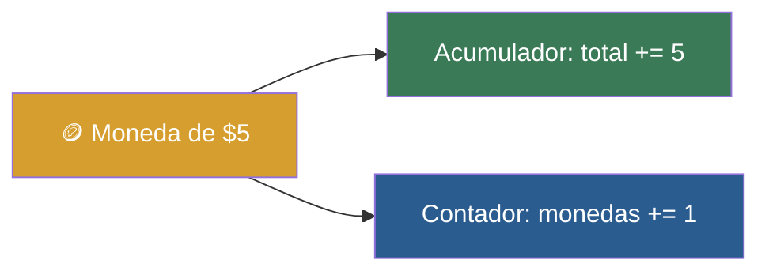

# 📑 Ejemplo 05: La Alcancía (Contadores y Acumuladores)

> **Concepto Clave:** Incrementar variables contadoras y acumuladoras.  
> **Metáfora:** Alcancía: Contar monedas (contador += 1) y sumar su valor (acumulador += moneda).

---

## 📊 Diagrama de Flujo del Ejemplo



---

## 🏃‍♂️ ¿Cómo ejecutar este ejemplo?

Abre tu terminal en VS Code y ejecuta:

```bash
python 01-fundamentos-python/clase-04-control-flujo-bucles/ejemplos/ejemplo-05-contador-acumulador-alcancia/05_contador_acumulador_alcancia.py
```

---

## 📄 Explicación Paso a Paso

1. Lee detenidamente los comentarios dentro del archivo [`05_contador_acumulador_alcancia.py`](05_contador_acumulador_alcancia.py).
2. Ejecuta el código y observa la salida en consola.
3. Revisa la sección final del archivo para ver el resumen conceptual explicativo.
