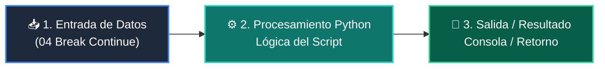

# 📖 04 Break Continue

> **Clase:** Clase 04: Control de Flujo: Bucles (for / while)  
> **Script:** [`main.py`](main.py)  

Ejemplo 04: break y continue en Bucles.

---

## 🗺️ Flujo de Ejecución del Ejemplo



---

## 💻 Ejecución desde Terminal

```bash
python 01-fundamentos-python/clase-04-control-flujo-bucles/ejemplos/ejemplo_04_break_continue/main.py
```
