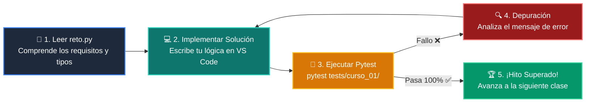

# 🏋️ Reto Práctico: Clase 04: Control de Flujo: Bucles (for / while)

<div align="center">

**Curso 1: Fundamentos Básicos de Python** &bull; **Semana CLASE 04**  
*Archivo de Trabajo:* [`reto.py`](reto.py) &bull; *Suite de Validación:* [`tests/curso_01/test_clase_04_control_flujo_bucles.py`](../../tests/curso_01/test_clase_04_control_flujo_bucles.py)

</div>

---

## 🎯 Enunciado del Desafío

> **Escribe un programa que imprima la tabla de multiplicar de un número del 1 al 10.**

---

## 🗺️ Ciclo de Resolución y Feedback Automatizado



---

## 🚀 Pasos para Resolver el Reto

1. Abre [`reto.py`](reto.py) en tu editor.
2. Lee las firmas de función, docstrings y restricciones.
3. Escribe tu solución reemplazando los comentarios `TODO`.
4. Valida tu solución en cualquier momento ejecutando en la terminal:
   ```bash
   pytest tests/curso_01/
   ```
