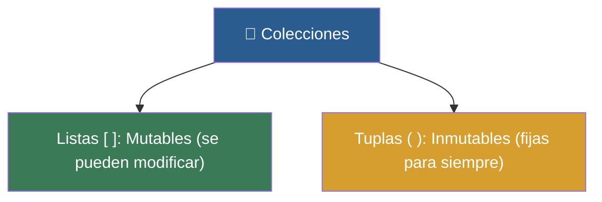

# 🎒 Clase 05: Listas y Colecciones - La Mochila del Programador

> **Objetivo:** Aprender a almacenar, modificar y manipular listas (mutables) y tuplas (inmutables).

---

## 💡 Diagrama Conceptual de la Clase

---

## 📚 Ejemplos Prácticos de la Clase

| Ejemplo | Concepto Principal | Metáfora del Mundo Real | Enlace al Material |
| :--- | :--- | :--- | :---: |
| **Ejemplo 01** | Acceso a elementos por índice base 0. | *Casillero numerado* | [📁 Ver Ejemplo](ejemplos/ejemplo-01-crear-y-acceder-listas/) |
| **Ejemplo 02** | Métodos mutadores .append() y .remove(). | *Mochila escolar* | [📁 Ver Ejemplo](ejemplos/ejemplo-02-modificar-y-agregar-elementos/) |
| **Ejemplo 03** | Funciones integradas len(), sort(), sum(), min(), max(). | *Mazo de cartas* | [📁 Ver Ejemplo](ejemplos/ejemplo-03-metodos-utiles-listas/) |
| **Ejemplo 04** | Estructuras inmutables con paréntesis (). | *Caja Fuerte Sellada* | [📁 Ver Ejemplo](ejemplos/ejemplo-04-tuplas-cajas-selladas/) |
| **Ejemplo 05** | Procesamiento de listas iterando con bucles for. | *Escanear en Caja* | [📁 Ver Ejemplo](ejemplos/ejemplo-05-listas-y-bucles-juntos/) |

---

## 🏋️ Ejercicio Práctico de la Clase

Revisa la carpeta de [ejercicios/](ejercicios/) para aplicar los conocimientos adquiridos.
