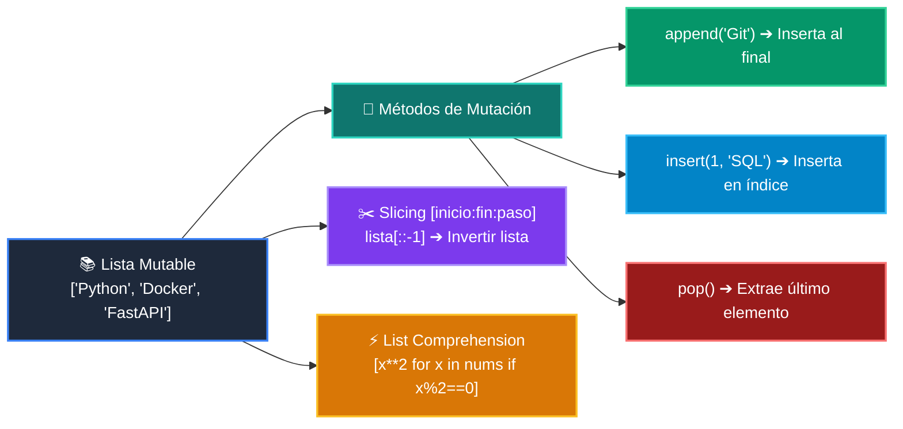

# 📘 Clase 05: Listas, Tuplas y Colecciones Básicas

<div align="center">

**Curso 1: Fundamentos Básicos de Python** &bull; **Semana CLASE 05**  
*Nivel:* `Nivel 1 - Principiante` &bull; *Metáfora Central:* **«Listas como Archivadores Modulares y Tuplas como Documentos Notariados»**

[](https://colab.research.google.com/github/wisrovi/wisrovi-python/blob/main/01-fundamentos-python/clase-05-listas-y-colecciones/notebook/clase-05-listas-y-colecciones.ipynb)
[](clase-05-listas-y-colecciones.pdf)
[](book.md)

</div>

---

## 🎯 Objetivos de Aprendizaje de la Sesión

*   **Competencia Conceptual:** Comprender el modelo mental de *«Listas como Archivadores Modulares y Tuplas como Documentos Notariados»* (Una lista es un archivador modular donde agregas carpetas; una tupla es un documento sellado inmutable.).
*   **Competencia Práctica:** Escribir, ejecutar y depurar scripts en Python aplicando buenas prácticas (PEP 8) y tipado.
*   **Competencia de Ingeniería:** Resolver el reto práctico de la sesión y verificar su correcto funcionamiento con la suite de pruebas automatizadas.

---

## 🗺️ Mapa de Arquitectura y Flujo de Ejecución



---

## 📂 Organización de Materiales en esta Clase

```text
clase-05-listas-y-colecciones/
├── 📄 clase-05-listas-y-colecciones.pdf       # Manual técnico oficial de estudio (9 páginas)
├── 📖 book.md                     # Libro digital interactivo con diagramas Mermaid
├── 📝 README.md                   # Esta guía general de la clase
├── 📁 notebook/                   # Cuaderno Jupyter interactivo
│   ├── 📓 clase-05-listas-y-colecciones.ipynb
│   └── 📝 README.md               # Guía con badge a Google Colab
├── 📁 ejemplos/                   # Carpetas de código estructurado paso a paso
│   └── 📝 README.md               # Catálogo de ejemplos con comandos de ejecución
└── 📁 ejercicios/                 # Reto práctico para el estudiante
    ├── 🐍 reto.py                 # Enunciado y plantilla del ejercicio
    └── 📝 README.md               # Instrucciones de resolución y comandos pytest
```

---

## 🏋️ Desafío Práctico de la Sesión
> **Enunciado:** Crea una función que elimine duplicados de una lista manteniendo el orden original.

Abre el archivo [`ejercicios/reto.py`](ejercicios/reto.py), completa tu implementación y valida tu código ejecutando:
```bash
pytest tests/curso_01/test_clase_05_listas_y_colecciones.py
```
