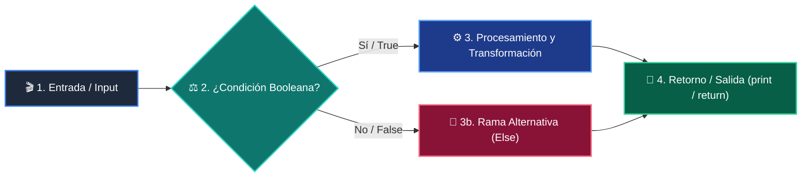

# 📚 Clase 05: Listas, Tuplas y Colecciones Básicas

> **Programa:** Curso 1: Fundamentos Básicos de Python  
> **Nivel:** Nivel 1 - Principiante  
> **Metáfora Central:** *«Listas como Archivadores Modulares y Tuplas como Documentos Notariados»*  
> **Documento Oficial PDF:** [clase-05-listas-y-colecciones.pdf](clase-05-listas-y-colecciones.pdf)  
> **Instructor:** **William Rodríguez (Wisrovi)** (AI Solutions Architect & Principal Software Engineer)  

---

## 👤 Perfil del Autor y Mentor

### **William Rodríguez (Wisrovi)**
*AI Solutions Architect & Principal Software Engineer &bull; Badajoz, España*

Ingeniero y arquitecto de software especializado en Inteligencia Artificial Generativa, sistemas multi-agente, Visión por Computador e infraestructuras MLOps de alta disponibilidad. Creador y mantenedor de la suite de software libre wisrovi SUITE en PyPI con más de 26 bibliotecas enfocadas en orquestación de pipelines, caching distribuido y optimización de bases de datos.

*   🐙 **GitHub:** [github.com/wisrovi](https://github.com/wisrovi)
*   💼 **LinkedIn:** [www.linkedin.com/in/wisrovi-rodriguez/](https://www.linkedin.com/in/wisrovi-rodriguez/)
*   🐳 **DockerHub:** [hub.docker.com/u/wisrovi](https://hub.docker.com/u/wisrovi)
*   🌐 **Website:** [wisrovi.dev](https://wisrovi.dev)
*   📦 **PyPI:** [pypi.org/user/wisrovi/](https://pypi.org/user/wisrovi/)

---

### 🚲 La Regla de la Bicicleta

> *"Nadie aprende a montar en bicicleta viendo tutoriales. El verdadero dominio de la programación surge cuando abres tu editor, escribes código con tus propias manos, resuelves errores y construyes proyectos reales."*

---

## 📑 Tabla de Contenidos de la Sesión

1. [💡 Fundamentación Teórica y Modelo Mental](#1--fundamentación-teórica-y-modelo-mental)
2. [🗺️ Arquitectura y Diagrama de Flujo](#2-️-arquitectura-y-diagrama-de-flujo)
3. [💻 Implementación en Python 3.10+](#3--implementación-en-python-310)
4. [🛡️ Buenas Prácticas y Trampas Frecuentes](#4-️-buenas-prácticas-y-trampas-frecuentes)
5. [🏋️ Desafío de Práctica](#5-️-desafío-de-práctica)
6. [📚 Bibliografía y Enlaces Canónicos](#6--bibliografía-y-enlaces-canónicos)

---

## 1. 💡 Fundamentación Teórica y Modelo Mental

Las listas y tuplas son secuencias ordenadas que permiten almacenar conjuntos estructurados de datos.

> [!NOTE]
> **🌟 Metáfora Didáctica:** Una lista es un archivador modular donde agregas carpetas; una tupla es un documento sellado inmutable.

### Principios Fundamentales

Las listas son mutables (su contenido cambia en memoria sin alterar su id).

Las tuplas son inmutables y consumen menos memoria.

> [!IMPORTANT]
> **⚡ Regla de Oro en Python:** Si los datos representan una entidad fija que no debe cambiar, usa una tupla.

---

## 2. 🗺️ Arquitectura y Diagrama de Flujo

Indexación, acceso por rebanadas (slicing) y mutabilidad.



### Desglose Paso a Paso del Flujo

| Fase | Acción del Intérprete | Estado en Memoria |
| :--- | :--- | :--- |
| **1. Inicialización** | Creación del arreglo dinámico de punteros. | `Lista instanciada en el heap.` |
| **2. Evaluación** | Acceso por índice O(1). | `Lectura instantánea de la dirección.` |
| **3. Transformación** | Modificación in-place con append. | `Redimensionamiento dinámico.` |
| **4. Retorno / Salida** | Extracción de subconjuntos mediante slicing. | `Nueva lista creada.` |

> [!TIP]
> **🔍 Visualización Mental:** El slicing lista[a:b] incluye el índice 'a' pero excluye el 'b'.

---

## 3. 💻 Implementación en Python 3.10+

```python
# CLASE 05 - Código de Demostración
inventario = ["Laptop", "Teclado", "Mouse"]
inventario.append("Monitor")
inventario.sort()

primeros_dos = inventario[:2]
print("Inventario ordenado:", inventario)
print("Top 2 productos:", primeros_dos)
```

*Método append modifica in-place, sort ordena alfabéticamente y [:2] extrae una rebanada.*

---

## 4. 🛡️ Buenas Prácticas y Trampas Frecuentes

> [!WARNING]
> **⚠️ Gotcha Frecuente (Trampa de Principiante):** Hacer lista_b = lista_a no crea una copia, crea otro puntero a la misma lista.

*   **❌ Antipatrón:**
    ```python
a = [1, 2, 3]
b = a
b.append(4)  # ❌ Modifica también 'a'
    ```

*   **✅ Patrón Correcto:**
    ```python
a = [1, 2, 3]
b = a.copy()  # ✅ 'a' permanece intacta
    ```

> [!TIP]
> **💡 Consejo Profesional:** Para listas con sublistas anidadas, usa copy.deepcopy().

---

## 5. 🏋️ Desafío de Práctica

> **Desafío:** Crea una función que elimine duplicados de una lista manteniendo el orden original.

Para ejecutar la verificación automática con pytest:
```bash
pytest ejercicios/
```

---

## 6. 📚 Bibliografía y Enlaces Canónicos

| Fuente / Recurso | Descripción | Enlace |
| :--- | :--- | :--- |
| **Documentación Oficial de Python** | Especificación y biblioteca estándar | [docs.python.org/3/](https://docs.python.org/3/) |
| **PEP 8 — Style Guide for Python** | Estándar oficial de formateo y estilo | [peps.python.org/pep-0008/](https://peps.python.org/pep-0008/) |
| **Real Python Tutorials** | Patrones de ingeniería y desarrollo | [realpython.com](https://realpython.com/) |
| **Suite Open Source wisrovi** | Librerías de alto rendimiento | [github.com/wisrovi](https://github.com/wisrovi) |
