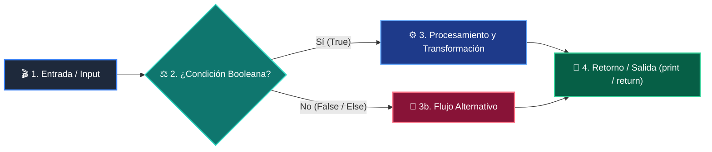

# 📖 Clase 05: Listas y Colecciones de Datos

> **Programa:** Curso 1: Fundamentos Básicos de Python (Nivel 1 (Principiantes))  
> **Nivel de Dificultad:** Principiante Absoluto  
> **Metáfora Central:** *«La Mochila del Programador y los Casilleros»*  
> **Python Version:** 3.10+ | **Licencia:** MIT  

---

## 👤 Acerca del Autor y Mentor

### **William Rodríguez (Wisrovi)**
**AI Solutions Architect & Principal Software Engineer** &bull; *Badajoz, España*

Ingeniero y arquitecto de software especializado en Inteligencia Artificial Generativa, sistemas multi-agente, Visión por Computador e infraestructuras MLOps de alta disponibilidad. Creador y mantenedor de la suite de software libre <strong>wisrovi SUITE</strong> en PyPI con más de 26 bibliotecas enfocadas en orquestación de pipelines, caching distribuido y optimización de bases de datos.

*   🐙 **GitHub:** [github.com/wisrovi](https://github.com/wisrovi)
*   💼 **LinkedIn:** [www.linkedin.com/in/wisrovi-rodriguez/](https://www.linkedin.com/in/wisrovi-rodriguez/)
*   🐳 **DockerHub:** [hub.docker.com/u/wisrovi](https://hub.docker.com/u/wisrovi)
*   🌐 **Website:** [wisrovi.dev](https://wisrovi.dev)
*   📦 **PyPI:** [pypi.org/user/wisrovi/](https://pypi.org/user/wisrovi/)

---

### 🚲 Metodología de Aprendizaje: La Regla de la Bicicleta

> *"Nadie aprende a montar en bicicleta viendo tutoriales. El verdadero dominio de la programación surge cuando abres tu editor, escribes código con tus propias manos, resuelves errores y construyes proyectos reales."*

> [!TIP]
> **El Compromiso Activo del Estudiante:** Abre Visual Studio Code en cada sesión. Escribe cada ejemplo con tus propias manos. Cambia los números, rompe el código deliberadamente para ver el mensaje de error de Python, y luego arréglalo.

---

## 📑 Tabla de Contenidos

| Capítulo | Tema | Enfoque Principal |
| :--- | :--- | :--- |
| **01** | **Fundamentos & Metáfora** | La Mochila de Datos y las Secuencias Ordenadas |
| **02** | **Arquitectura de Flujo** | Anatomía de la Indexación y Operaciones de Slicing |
| **03** | **Implementación Práctica** | Gestión de Carrito de Compras con Listas |
| **04** | **Patrones & Debugging** | Gotchas Clásicos con Listas |
| **05** | **Conclusiones & Cierre** | Resumen ejecutivo, notas del mentor y agradecimiento |
| **06** | **Bibliografía & Recursos** | Fuentes oficiales y retos de autoestudio |

### 🎯 Objetivos de Aprendizaje

*   **Competencia Conceptual:** Comprender la indexación basada en cero (0-indexed), la mutabilidad de listas y la inmutabilidad de tuplas.
*   **Competencia Práctica:** Manipular colecciones mediante append(), insert(), pop(), slicing avanzado y comprensión de listas básica.

---

## 1. 💡 La Mochila de Datos y las Secuencias Ordenadas

En el mundo real rara vez trabajamos con datos aislados; casi siempre gestionamos conjuntos de elementos como listas de clientes, precios o mediciones.

> [!NOTE]
> ### 🌟 Metáfora Central: La Mochila del Programador y los Casilleros
> Imagina una fila de casilleros escolares numerados desde el 0. En cada casillero puedes guardar lo que quieras. Las listas son casilleros que puedes abrir, cambiar y reordenar (mutables). Las tuplas son cajas de cristal selladas: puedes ver lo que hay dentro, pero nadie puede alterarlo (inmutables).

### Principios Teóricos y Modelo Mental

Indexación: El primer elemento está en el índice 0, y el último en el índice -1.

Slicing: La sintaxis lista[inicio:fin:paso] permite extraer subconjuntos sin modificar la lista original.

> [!IMPORTANT]
> ### ⚡ Regla de Oro en Python
> Las listas son mutables (se modifican en el mismo lugar de memoria); las tuplas son inmutables y ofrecen mayor seguridad e integridad.

---

## 2. 🗺️ Anatomía de la Indexación y Operaciones de Slicing

Mapeo de memoria para índices directos, inversos y sub-rangos de datos.

### Diagrama Visual del Flujo



### Desglose Paso a Paso del Flujo

| Fase del Flujo | Acción del Intérprete | Estado en Memoria |
| :--- | :--- | :--- |
| **1. Inicialización** | Python asigna un puntero de memoria ordenado a cada elemento. | `['A', 'B', 'C', 'D']` |
| **2. Evaluación** | Índices positivos: [0]=A, [1]=B, [2]=C, [3]=D. | `Lectura hacia adelante` |
| **3. Transformación** | Índices negativos: [-1]=D, [-2]=C, [-3]=B, [-4]=A. | `Lectura desde el final` |
| **4. Retorno / Salida** | Slicing [1:3] extrae los índices 1 y 2 (el límite superior es excluyente). | `Nueva lista: ['B', 'C']` |

> [!TIP]
> **Visualización Mental:** Recuerda siempre la regla del límite superior: lista[0:3] extrae 3 elementos (índices 0, 1 y 2), el 3 queda fuera.

---

## 3. 💻 Gestión de Carrito de Compras con Listas

Script que aplica operaciones CRUD sobre listas de Python con métodos nativos:

```python
# main.py - Python 3.10+ PEP 8 Compliant
carrito: list[str] = ["Laptop", "Mouse", "Teclado"]

# 1. Agregar elementos
carrito.append("Monitor 4K")
carrito.insert(1, "Auriculares")

# 2. Slicing (primeros 3 productos)
prioritarios = carrito[0:3]
print(f"Productos prioritarios: {prioritarios}")

# 3. Eliminar y extraer
eliminado = carrito.pop()
print(f"Producto extraído: {eliminado}")

# 4. Iteración elegante con enumeración
for idx, prod in enumerate(carrito, start=1):
    print(f"{idx}. {prod}")
```

### Análisis del Código Fuente

Uso de métodos nativos append, insert, pop, slicing y la función enumerate() para iteración limpia con índices.

---

## 4. 🛡️ Gotchas Clásicos con Listas

Errores comunes al manipular listas y colecciones mutables:

> [!WARNING]
> ### ⚠️ Gotcha Frecuente (Trampa de Principiante)
> Copiar una lista por asignación simple (lista2 = lista1) solo copia la referencia, no los datos.

### Comparativa: Antipatrón vs Patrón Recomendado

#### ❌ Antipatrón / Mal Código:
```python
a = [1, 2, 3]
b = a
b.append(4) # ¡Modifica también la lista 'a'!
```

#### ✅ Patrón Pythonic / Correcto:
```python
a = [1, 2, 3]
b = a.copy() # Copia superficial independiente
b.append(4)
```

> [!TIP]
> **Consejo de Resiliencia en Producción:** Usa lista[:] o lista.copy() cuando quieras duplicar una lista sin afectar la original.

---

## 5. 🏆 Conclusiones y Resumen Ejecutivo

Has dominado el uso de listas y tuplas, la indexación bidireccional y las operaciones fundamentales de colección.

> [!NOTE]
> ### 🎖️ Logro Alcanzado
> Capacidad para estructurar y transformar conjuntos secuenciales de información.

### 📝 Notas del Instructor
En la próxima clase conoceremos los Diccionarios: la estructura clave-valor que potencia la web moderna y los formatos JSON.

### 🤝 Mensaje de Agradecimiento
Muchas gracias por tu entusiasmo, disciplina y dedicación al participar en este programa formativo. La programación es un superpoder que transforma vidas cuando se ejerce con constancia y curiosidad. ¡Nos vemos en la próxima sesión para seguir construyendo juntos! 💻🚀

---

## 6. 📚 Bibliografía y Fuentes de Estudio

| Fuente / Recurso | Descripción Temática | Enlace Oficial |
| :--- | :--- | :--- |
| **Documentación Oficial de Python** | Referencia canónica del lenguaje y librería estándar | [docs.python.org/3/](https://docs.python.org/3/) |
| **PEP 8 — Style Guide for Python** | Guía oficial de estilo, formato e indentación | [peps.python.org/pep-0008/](https://peps.python.org/pep-0008/) |
| **Real Python Tutorials** | Artículos técnicos y patrones de desarrollo moderno | [realpython.com](https://realpython.com/) |
| **Python Type Checking (PEP 484)** | Anotaciones de tipo y análisis estático | [docs.python.org/typing](https://docs.python.org/3/library/typing.html) |
| **Suite Open Source wisrovi** | Paquetes Python para orquestación y rendimiento | [github.com/wisrovi](https://github.com/wisrovi) |

> [!TIP]
> ### 🏋️ Desafío de Autoestudio Recomendado
> Crea una función que reciba una lista de números y devuelva una tupla con (mínimo, máximo, promedio).
