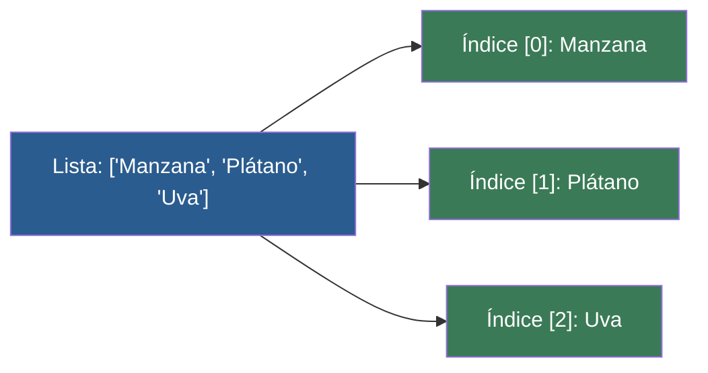

# 📑 Ejemplo 01: El Casillero Numerado (Listas e Índices)

> **Concepto Clave:** Acceso a elementos por índice base 0.  
> **Metáfora:** Casillero numerado: La posición 0 es la primera puerta.

---

## 📊 Diagrama de Flujo del Ejemplo



---

## 🏃‍♂️ ¿Cómo ejecutar este ejemplo?

Abre tu terminal en VS Code y ejecuta:

```bash
python 01-fundamentos-python/clase-05-listas-y-colecciones/ejemplos/ejemplo-01-crear-y-acceder-listas/01_crear_y_acceder_listas.py
```

---

## 📄 Explicación Paso a Paso

1. Lee detenidamente los comentarios dentro del archivo [`01_crear_y_acceder_listas.py`](01_crear_y_acceder_listas.py).
2. Ejecuta el código y observa la salida en consola.
3. Revisa la sección final del archivo para ver el resumen conceptual explicativo.
