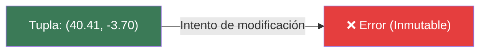

# 📑 Ejemplo 04: Las Cajas Fuertes Selladas (Tuplas ())

> **Concepto Clave:** Estructuras inmutables con paréntesis ().  
> **Metáfora:** Caja Fuerte Sellada: Datos que nunca deben ser modificados accidentalmente.

---

## 📊 Diagrama de Flujo del Ejemplo



---

## 🏃‍♂️ ¿Cómo ejecutar este ejemplo?

Abre tu terminal en VS Code y ejecuta:

```bash
python 01-fundamentos-python/clase-05-listas-y-colecciones/ejemplos/ejemplo-04-tuplas-cajas-selladas/04_tuplas_cajas_selladas.py
```

---

## 📄 Explicación Paso a Paso

1. Lee detenidamente los comentarios dentro del archivo [`04_tuplas_cajas_selladas.py`](04_tuplas_cajas_selladas.py).
2. Ejecuta el código y observa la salida en consola.
3. Revisa la sección final del archivo para ver el resumen conceptual explicativo.
