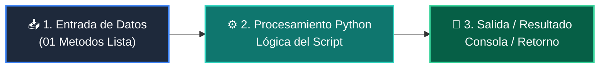

# 📖 01 Metodos Lista

> **Clase:** Clase 05: Listas, Tuplas y Colecciones Básicas  
> **Script:** [`main.py`](main.py)  

Ejemplo 01: Métodos Principales de Listas.

---

## 🗺️ Flujo de Ejecución del Ejemplo



---

## 💻 Ejecución desde Terminal

```bash
python 01-fundamentos-python/clase-05-listas-y-colecciones/ejemplos/ejemplo_01_metodos_lista/main.py
```
