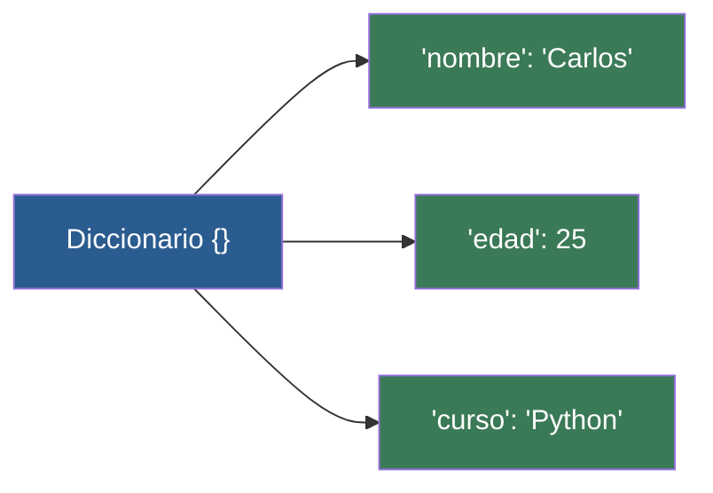

# 📖 Clase 06: Diccionarios - La Agenda Clave-Valor

> **Objetivo:** Aprender a estructurar información compleja asociando etiquetas (claves) a contenidos (valores).

---

## 💡 Diagrama Conceptual de la Clase

---

## 📚 Ejemplos Prácticos de la Clase

| Ejemplo | Concepto Principal | Metáfora del Mundo Real | Enlace al Material |
| :--- | :--- | :--- | :---: |
| **Ejemplo 01** | Definición de pares clave: valor en llaves {}. | *DNI / Ficha técnica* | [📁 Ver Ejemplo](ejemplos/ejemplo-01-crear-diccionario/) |
| **Ejemplo 02** | Añadir y modificar pares clave-valor dinámicamente. | *Actualizar agenda* | [📁 Ver Ejemplo](ejemplos/ejemplo-02-acceder-y-modificar-claves/) |
| **Ejemplo 03** | Métodos de inspección y lectura segura de claves. | *Ver el Índice* | [📁 Ver Ejemplo](ejemplos/ejemplo-03-metodos-diccionarios/) |
| **Ejemplo 04** | Diccionarios dentro de diccionarios. | *Subcarpetas* | [📁 Ver Ejemplo](ejemplos/ejemplo-04-diccionarios-anidados/) |
| **Ejemplo 05** | Iterar sobre pares clave-valor usando bucle for y .items(). | *Lectura de fichas* | [📁 Ver Ejemplo](ejemplos/ejemplo-05-recorrer-diccionarios-con-for/) |

---

## 🏋️ Ejercicio Práctico de la Clase

Revisa la carpeta de [ejercicios/](ejercicios/) para aplicar los conocimientos adquiridos.
