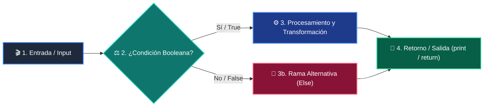

# 📚 Clase 06: Diccionarios y Conjuntos (Sets)

> **Programa:** Curso 1: Fundamentos Básicos de Python  
> **Nivel:** Nivel 1 - Principiante  
> **Metáfora Central:** *«Diccionarios como un Casillero con Llaves Únicas»*  
> **Documento Oficial PDF:** [clase-06-diccionarios.pdf](clase-06-diccionarios.pdf)  
> **Instructor:** **William Rodríguez (Wisrovi)** (AI Solutions Architect & Principal Software Engineer)  

---

## 👤 Perfil del Autor y Mentor

### **William Rodríguez (Wisrovi)**
*AI Solutions Architect & Principal Software Engineer &bull; Badajoz, España*

Ingeniero y arquitecto de software especializado en Inteligencia Artificial Generativa, sistemas multi-agente, Visión por Computador e infraestructuras MLOps de alta disponibilidad. Creador y mantenedor de la suite de software libre wisrovi SUITE en PyPI con más de 26 bibliotecas enfocadas en orquestación de pipelines, caching distribuido y optimización de bases de datos.

*   🐙 **GitHub:** [github.com/wisrovi](https://github.com/wisrovi)
*   💼 **LinkedIn:** [www.linkedin.com/in/wisrovi-rodriguez/](https://www.linkedin.com/in/wisrovi-rodriguez/)
*   🐳 **DockerHub:** [hub.docker.com/u/wisrovi](https://hub.docker.com/u/wisrovi)
*   🌐 **Website:** [wisrovi.dev](https://wisrovi.dev)
*   📦 **PyPI:** [pypi.org/user/wisrovi/](https://pypi.org/user/wisrovi/)

---

### 🚲 La Regla de la Bicicleta

> *"Nadie aprende a montar en bicicleta viendo tutoriales. El verdadero dominio de la programación surge cuando abres tu editor, escribes código con tus propias manos, resuelves errores y construyes proyectos reales."*

---

## 📑 Tabla de Contenidos de la Sesión

1. [💡 Fundamentación Teórica y Modelo Mental](#1--fundamentación-teórica-y-modelo-mental)
2. [🗺️ Arquitectura y Diagrama de Flujo](#2-️-arquitectura-y-diagrama-de-flujo)
3. [💻 Implementación en Python 3.10+](#3--implementación-en-python-310)
4. [🛡️ Buenas Prácticas y Trampas Frecuentes](#4-️-buenas-prácticas-y-trampas-frecuentes)
5. [🏋️ Desafío de Práctica](#5-️-desafío-de-práctica)
6. [📚 Bibliografía y Enlaces Canónicos](#6--bibliografía-y-enlaces-canónicos)

---

## 1. 💡 Fundamentación Teórica y Modelo Mental

Los diccionarios son colecciones asociativas basadas en pares clave-valor que permiten accesos ultra rápidos.

> [!NOTE]
> **🌟 Metáfora Didáctica:** Un diccionario es como un casillero: con tu llave (clave) abres instantáneamente el compartimento (valor).

### Principios Fundamentales

Las claves deben ser objetos inmutables y hashables (strings, números, tuplas).

Los conjuntos (sets) son colecciones no ordenadas de elementos únicos.

> [!IMPORTANT]
> **⚡ Regla de Oro en Python:** Usa siempre diccionario.get('clave', default) para evitar excepciones KeyError.

---

## 2. 🗺️ Arquitectura y Diagrama de Flujo

Hashing de claves, mapeo en tabla interna y operaciones de conjuntos.



### Desglose Paso a Paso del Flujo

| Fase | Acción del Intérprete | Estado en Memoria |
| :--- | :--- | :--- |
| **1. Inicialización** | Cálculo del hash mediante hash(key). | `Hash entero generado.` |
| **2. Evaluación** | Indexación en la tabla hash interna. | `Ubicación del bucket.` |
| **3. Transformación** | Recuperación del puntero al valor. | `Acceso O(1).` |
| **4. Retorno / Salida** | Iteración sobre items() o keys(). | `Vista dinámica generada.` |

> [!TIP]
> **🔍 Visualización Mental:** Imagina los sets como un filtro que rechaza automáticamente cualquier duplicado.

---

## 3. 💻 Implementación en Python 3.10+

```python
# CLASE 06 - Código de Demostración
usuario = {
    "id": 101,
    "nombre": "Carlos Ruiz",
    "roles": {"admin", "editor"},
    "activo": True
}

email = usuario.get("email", "sin_correo@empresa.com")
print(f"Usuario: {usuario['nombre']} | Email: {email}")
```

*Uso de .get() seguro con valor por defecto y set para roles sin duplicados.*

---

## 4. 🛡️ Buenas Prácticas y Trampas Frecuentes

> [!WARNING]
> **⚠️ Gotcha Frecuente (Trampa de Principiante):** Hacer data['no_existe'] lanza KeyError en lugar de devolver None.

*   **❌ Antipatrón:**
    ```python
data = {'a': 1}
val = data['b']  # ❌ KeyError
    ```

*   **✅ Patrón Correcto:**
    ```python
data = {'a': 1}
val = data.get('b', 0)  # ✅ Seguro
    ```

> [!TIP]
> **💡 Consejo Profesional:** Utiliza collections.defaultdict para inicializar contadores automáticos.

---

## 5. 🏋️ Desafío de Práctica

> **Desafío:** Crea una función que reciba un texto y cuente la frecuencia de cada palabra con un diccionario.

Para ejecutar la verificación automática con pytest:
```bash
pytest ejercicios/
```

---

## 6. 📚 Bibliografía y Enlaces Canónicos

| Fuente / Recurso | Descripción | Enlace |
| :--- | :--- | :--- |
| **Documentación Oficial de Python** | Especificación y biblioteca estándar | [docs.python.org/3/](https://docs.python.org/3/) |
| **PEP 8 — Style Guide for Python** | Estándar oficial de formateo y estilo | [peps.python.org/pep-0008/](https://peps.python.org/pep-0008/) |
| **Real Python Tutorials** | Patrones de ingeniería y desarrollo | [realpython.com](https://realpython.com/) |
| **Suite Open Source wisrovi** | Librerías de alto rendimiento | [github.com/wisrovi](https://github.com/wisrovi) |
