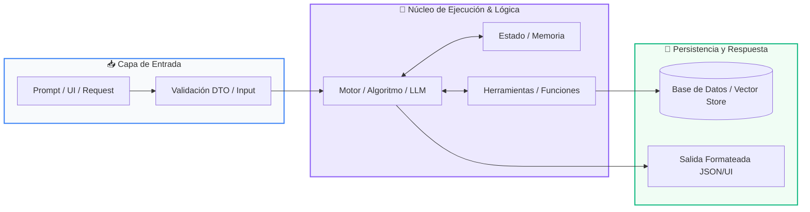

# 📖 Clase 06: Diccionarios y Mapeos Clave-Valor

> **Programa:** Curso 1: Fundamentos Básicos de Python (Nivel 1 (Principiantes))  
> **Nivel de Dificultad:** Principiante Absoluto  
> **Metáfora Central:** *«La Agenda Telefónica y el Expediente Médico»*  
> **Python Version:** 3.10+ | **Licencia:** MIT  

---

## 👤 Acerca del Autor y Mentor

### **William Rodríguez (Wisrovi)**
**AI Solutions Architect & Principal Software Engineer** &bull; *Badajoz, España*

Ingeniero y arquitecto de software especializado en Inteligencia Artificial Generativa, sistemas multi-agente, Visión por Computador e infraestructuras MLOps de alta disponibilidad. Creador y mantenedor de la suite de software libre <strong>wisrovi SUITE</strong> en PyPI con más de 26 bibliotecas enfocadas en orquestación de pipelines, caching distribuido y optimización de bases de datos.

*   🐙 **GitHub:** [github.com/wisrovi](https://github.com/wisrovi)
*   💼 **LinkedIn:** [www.linkedin.com/in/wisrovi-rodriguez/](https://www.linkedin.com/in/wisrovi-rodriguez/)
*   🐳 **DockerHub:** [hub.docker.com/u/wisrovi](https://hub.docker.com/u/wisrovi)
*   🌐 **Website:** [wisrovi.dev](https://wisrovi.dev)
*   📦 **PyPI:** [pypi.org/user/wisrovi/](https://pypi.org/user/wisrovi/)

---

### 🚲 Metodología de Aprendizaje: La Regla de la Bicicleta

> *"Nadie aprende a montar en bicicleta viendo tutoriales. El verdadero dominio de la programación surge cuando abres tu editor, escribes código con tus propias manos, resuelves errores y construyes proyectos reales."*

> [!TIP]
> **El Compromiso Activo del Estudiante:** Abre Visual Studio Code en cada sesión. Escribe cada ejemplo con tus propias manos. Cambia los números, rompe el código deliberadamente para ver el mensaje de error de Python, y luego arréglalo.

---

## 📑 Tabla de Contenidos

| Capítulo | Tema | Enfoque Principal |
| :--- | :--- | :--- |
| **01** | **Fundamentos & Metáfora** | Mapeos Asociativos y la Estructura Clave-Valor |
| **02** | **Arquitectura de Flujo** | Arquitectura de un Diccionario y Búsqueda por Hash |
| **03** | **Implementación Práctica** | Sistema de Gestión de Inventario con Diccionarios |
| **04** | **Patrones & Debugging** | Gotchas Clásicos con Diccionarios |
| **05** | **Conclusiones & Cierre** | Resumen ejecutivo, notas del mentor y agradecimiento |
| **06** | **Bibliografía & Recursos** | Fuentes oficiales y retos de autoestudio |

### 🎯 Objetivos de Aprendizaje

*   **Competencia Conceptual:** Comprender la indexación por clave semántica en lugar de posición numérica y la eficiencia O(1) de las tablas hash.
*   **Competencia Práctica:** Construir modelos de datos complejos con diccionarios anidados y procesar registros estructurados.

---

## 1. 💡 Mapeos Asociativos y la Estructura Clave-Valor

Buscar un dato por su posición (índice 4) es poco intuitivo; en el mundo real buscamos por nombre, correo o ID.

> [!NOTE]
> ### 🌟 Metáfora Central: La Agenda Telefónica y el Expediente Médico
> Un diccionario es como tu agenda del teléfono: no buscas a tu mamá por el número de orden en que la agregaste, buscas la etiqueta 'Mamá' (la clave) y obtienes su número de teléfono (el valor).

### Principios Teóricos y Modelo Mental

Las claves en un diccionario deben ser únicas e inmutables (comúnmente strings o ints). Los valores pueden ser de cualquier tipo, incluidas listas u otros diccionarios.

La búsqueda en un diccionario es instantánea (tiempo constante O(1)) gracias al algoritmo interno de tabla hash.

> [!IMPORTANT]
> ### ⚡ Regla de Oro en Python
> Nunca accedas a una clave con dict['clave'] si no estás 100% seguro de que existe; usa dict.get('clave', valor_por_defecto) para evitar KeyError.

---

## 2. 🗺️ Arquitectura de un Diccionario y Búsqueda por Hash

Cómo Python mapea claves alfanuméricas a ubicaciones de memoria específicas.

### Diagrama Visual del Flujo



### Desglose Paso a Paso del Flujo

| Fase del Flujo | Acción del Intérprete | Estado en Memoria |
| :--- | :--- | :--- |
| **1. Inicialización** | Python aplica una función hash a la clave (ej: hash('email')). | `Clave -> Hash ID numérico` |
| **2. Evaluación** | Localiza el casillero exacto en la tabla hash de memoria. | `Búsqueda O(1)` |
| **3. Transformación** | Recupera o modifica el valor asociado sin recorrer toda la estructura. | `Lectura/Escritura inmediata` |
| **4. Retorno / Salida** | Permite serialización directa hacia y desde formato JSON para APIs web. | `Compatibilidad universal` |

> [!TIP]
> **Visualización Mental:** Los diccionarios son el equivalente en Python a los objetos de JavaScript o los registros de bases de datos NoSQL.

---

## 3. 💻 Sistema de Gestión de Inventario con Diccionarios

Manipulación de registros de productos con métodos .get(), .items() y anidamiento:

```python
# main.py - Python 3.10+ PEP 8 Compliant
inventario = {
    "PROD-001": {"nombre": "Teclado Mecánico", "precio": 85.0, "stock": 12},
    "PROD-002": {"nombre": "Mouse Ergonómico", "precio": 45.0, "stock": 0}
}

# Acceso seguro con .get()
sku_buscado = "PROD-001"
producto = inventario.get(sku_buscado, None)

if producto:
    print(f"Producto: {producto['nombre']} | Stock: {producto['stock']} uds")

# Iteración completa de claves y valores
for sku, datos in inventario.items():
    disponible = "En Stock" if datos["stock"] > 0 else "Agotado"
    print(f"[{sku}] {datos['nombre']} -> {disponible}")
```

### Análisis del Código Fuente

Se utiliza una estructura anidada dict-of-dicts, acceso resiliente con get() y desempaquetado de tuplas con el método .items().

---

## 4. 🛡️ Gotchas Clásicos con Diccionarios

Errores habituales al consultar y mutar diccionarios:

> [!WARNING]
> ### ⚠️ Gotcha Frecuente (Trampa de Principiante)
> Consultar una clave inexistente con corchetes (dict['inexistente']) provoca un KeyError que detiene el programa.

### Comparativa: Antipatrón vs Patrón Recomendado

#### ❌ Antipatrón / Mal Código:
```python
user = {'nombre': 'Leo'}
print(user['edad']) # KeyError: 'edad'
```

#### ✅ Patrón Pythonic / Correcto:
```python
user = {'nombre': 'Leo'}
print(user.get('edad', 0)) # Retorna 0 de forma segura
```

> [!TIP]
> **Consejo de Resiliencia en Producción:** Utiliza dictionary comprehensions ({k: v for k, v in ...}) para filtrar y transformar diccionarios en una sola línea.

---

## 5. 🏆 Conclusiones y Resumen Ejecutivo

Comprendes a fondo los diccionarios, la estructura clave-valor y el modelado de entidades del mundo real.

> [!NOTE]
> ### 🎖️ Logro Alcanzado
> Capacidad para manipular datos estructurados complejos, payloads JSON y configuraciones de software.

### 📝 Notas del Instructor
En la próxima clase estudiaremos las Funciones (def): el arte de empaquetar código reutilizable y modular.

### 🤝 Mensaje de Agradecimiento
Muchas gracias por tu entusiasmo, disciplina y dedicación al participar en este programa formativo. La programación es un superpoder que transforma vidas cuando se ejerce con constancia y curiosidad. ¡Nos vemos en la próxima sesión para seguir construyendo juntos! 💻🚀

---

## 6. 📚 Bibliografía y Fuentes de Estudio

| Fuente / Recurso | Descripción Temática | Enlace Oficial |
| :--- | :--- | :--- |
| **Documentación Oficial de Python** | Referencia canónica del lenguaje y librería estándar | [docs.python.org/3/](https://docs.python.org/3/) |
| **PEP 8 — Style Guide for Python** | Guía oficial de estilo, formato e indentación | [peps.python.org/pep-0008/](https://peps.python.org/pep-0008/) |
| **Real Python Tutorials** | Artículos técnicos y patrones de desarrollo moderno | [realpython.com](https://realpython.com/) |
| **Python Type Checking (PEP 484)** | Anotaciones de tipo y análisis estático | [docs.python.org/typing](https://docs.python.org/3/library/typing.html) |
| **Suite Open Source wisrovi** | Paquetes Python para orquestación y rendimiento | [github.com/wisrovi](https://github.com/wisrovi) |

> [!TIP]
> ### 🏋️ Desafío de Autoestudio Recomendado
> Crea una función que reciba una lista de palabras y devuelva un diccionario con la frecuencia de aparición de cada palabra.
