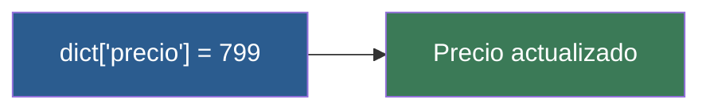

# 📑 Ejemplo 02: Actualizar la Ficha (Modificar claves)

> **Concepto Clave:** Añadir y modificar pares clave-valor dinámicamente.  
> **Metáfora:** Actualizar agenda: Cambiar un número o agregar el email a un contacto.

---

## 📊 Diagrama de Flujo del Ejemplo



---

## 🏃‍♂️ ¿Cómo ejecutar este ejemplo?

Abre tu terminal en VS Code y ejecuta:

```bash
python 01-fundamentos-python/clase-06-diccionarios/ejemplos/ejemplo-02-acceder-y-modificar-claves/02_acceder_y_modificar_claves.py
```

---

## 📄 Explicación Paso a Paso

1. Lee detenidamente los comentarios dentro del archivo [`02_acceder_y_modificar_claves.py`](02_acceder_y_modificar_claves.py).
2. Ejecuta el código y observa la salida en consola.
3. Revisa la sección final del archivo para ver el resumen conceptual explicativo.
