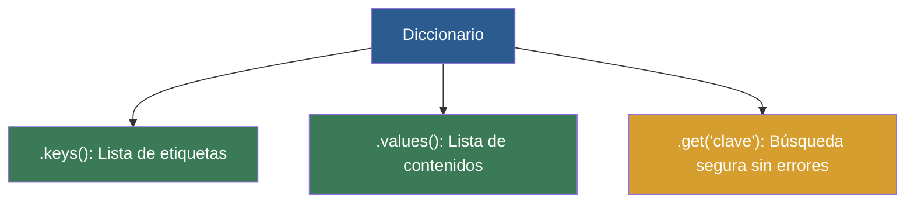

# 📑 Ejemplo 03: Ver el Índice (.keys, .values, .get)

> **Concepto Clave:** Métodos de inspección y lectura segura de claves.  
> **Metáfora:** Ver el Índice: Obtener la lista de nombres o teléfonos registrados.

---

## 📊 Diagrama de Flujo del Ejemplo



---

## 🏃‍♂️ ¿Cómo ejecutar este ejemplo?

Abre tu terminal en VS Code y ejecuta:

```bash
python 01-fundamentos-python/clase-06-diccionarios/ejemplos/ejemplo-03-metodos-diccionarios/03_metodos_diccionarios.py
```

---

## 📄 Explicación Paso a Paso

1. Lee detenidamente los comentarios dentro del archivo [`03_metodos_diccionarios.py`](03_metodos_diccionarios.py).
2. Ejecuta el código y observa la salida en consola.
3. Revisa la sección final del archivo para ver el resumen conceptual explicativo.
