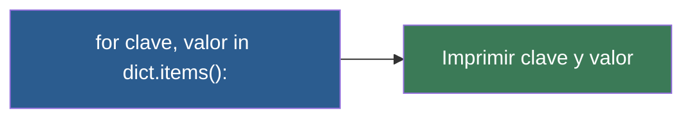

# 📑 Ejemplo 05: Lectura de Fichas (.items())

> **Concepto Clave:** Iterar sobre pares clave-valor usando bucle for y .items().  
> **Metáfora:** Lectura de fichas: Recorrer el archivador y leer cada pareja etiqueta-valor.

---

## 📊 Diagrama de Flujo del Ejemplo



---

## 🏃‍♂️ ¿Cómo ejecutar este ejemplo?

Abre tu terminal en VS Code y ejecuta:

```bash
python 01-fundamentos-python/clase-06-diccionarios/ejemplos/ejemplo-05-recorrer-diccionarios-con-for/05_recorrer_diccionarios_con_for.py
```

---

## 📄 Explicación Paso a Paso

1. Lee detenidamente los comentarios dentro del archivo [`05_recorrer_diccionarios_con_for.py`](05_recorrer_diccionarios_con_for.py).
2. Ejecuta el código y observa la salida en consola.
3. Revisa la sección final del archivo para ver el resumen conceptual explicativo.
