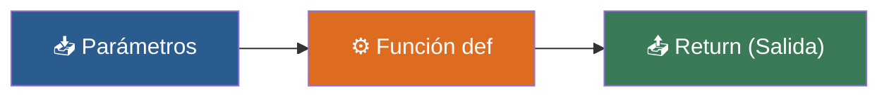

# ⚙️ Clase 07: Funciones (def) - Fábricas de Código Reutilizable

> **Objetivo:** Aprender a empaquetar lógica en funciones con parámetros y valores de retorno (return).

---

## 💡 Diagrama Conceptual de la Clase

---

## 📚 Ejemplos Prácticos de la Clase

| Ejemplo | Concepto Principal | Metáfora del Mundo Real | Enlace al Material |
| :--- | :--- | :--- | :---: |
| **Ejemplo 01** | Sintaxis def e invocación de funciones. | *El Botón de Sonido* | [📁 Ver Ejemplo](ejemplos/ejemplo-01-mi-primera-funcion/) |
| **Ejemplo 02** | Entrada de variables a funciones mediante parámetros. | *Ingredientes de la pizza* | [📁 Ver Ejemplo](ejemplos/ejemplo-02-parametros-ingredientes/) |
| **Ejemplo 03** | Devolución de valores mediante return. | *El Cajero Automático* | [📁 Ver Ejemplo](ejemplos/ejemplo-03-return-la-entrega/) |
| **Ejemplo 04** | Valores predeterminados en parámetros de funciones. | *Café Estándar* | [📁 Ver Ejemplo](ejemplos/ejemplo-04-valores-por-defecto/) |
| **Ejemplo 05** | Variables locales vs globales. | *Mochila Privada vs Plaza Pública* | [📁 Ver Ejemplo](ejemplos/ejemplo-05-alcance-scope/) |

---

## 🏋️ Ejercicio Práctico de la Clase

Revisa la carpeta de [ejercicios/](ejercicios/) para aplicar los conocimientos adquiridos.
