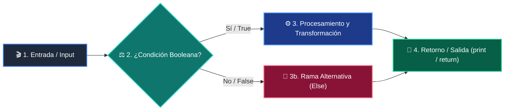

# 📚 Clase 07: Funciones, Parámetros y Scope

> **Programa:** Curso 1: Fundamentos Básicos de Python  
> **Nivel:** Nivel 1 - Principiante  
> **Metáfora Central:** *«Funciones como Máquinas Reutilizables de una Fábrica»*  
> **Documento Oficial PDF:** [clase-07-funciones.pdf](clase-07-funciones.pdf)  
> **Instructor:** **William Rodríguez (Wisrovi)** (AI Solutions Architect & Principal Software Engineer)  

---

## 👤 Perfil del Autor y Mentor

### **William Rodríguez (Wisrovi)**
*AI Solutions Architect & Principal Software Engineer &bull; Badajoz, España*

Ingeniero y arquitecto de software especializado en Inteligencia Artificial Generativa, sistemas multi-agente, Visión por Computador e infraestructuras MLOps de alta disponibilidad. Creador y mantenedor de la suite de software libre wisrovi SUITE en PyPI con más de 26 bibliotecas enfocadas en orquestación de pipelines, caching distribuido y optimización de bases de datos.

*   🐙 **GitHub:** [github.com/wisrovi](https://github.com/wisrovi)
*   💼 **LinkedIn:** [www.linkedin.com/in/wisrovi-rodriguez/](https://www.linkedin.com/in/wisrovi-rodriguez/)
*   🐳 **DockerHub:** [hub.docker.com/u/wisrovi](https://hub.docker.com/u/wisrovi)
*   🌐 **Website:** [wisrovi.dev](https://wisrovi.dev)
*   📦 **PyPI:** [pypi.org/user/wisrovi/](https://pypi.org/user/wisrovi/)

---

### 🚲 La Regla de la Bicicleta

> *"Nadie aprende a montar en bicicleta viendo tutoriales. El verdadero dominio de la programación surge cuando abres tu editor, escribes código con tus propias manos, resuelves errores y construyes proyectos reales."*

---

## 📑 Tabla de Contenidos de la Sesión

1. [💡 Fundamentación Teórica y Modelo Mental](#1--fundamentación-teórica-y-modelo-mental)
2. [🗺️ Arquitectura y Diagrama de Flujo](#2-️-arquitectura-y-diagrama-de-flujo)
3. [💻 Implementación en Python 3.10+](#3--implementación-en-python-310)
4. [🛡️ Buenas Prácticas y Trampas Frecuentes](#4-️-buenas-prácticas-y-trampas-frecuentes)
5. [🏋️ Desafío de Práctica](#5-️-desafío-de-práctica)
6. [📚 Bibliografía y Enlaces Canónicos](#6--bibliografía-y-enlaces-canónicos)

---

## 1. 💡 Fundamentación Teórica y Modelo Mental

Las funciones son bloques de código reutilizables diseñados para realizar una tarea específica.

> [!NOTE]
> **🌟 Metáfora Didáctica:** Una función es como un electrodoméstico: introduces ingredientes (argumentos) y recibes el resultado (return).

### Principios Fundamentales

Principio DRY (Don't Repeat Yourself): Si repites código, conviértelo en una función.

Regla de Scope LEGB: Python busca variables en orden: Local -> Enclosing -> Global -> Built-in.

> [!IMPORTANT]
> **⚡ Regla de Oro en Python:** Toda función debe tener una sola responsabilidad clara.

---

## 2. 🗺️ Arquitectura y Diagrama de Flujo

Pila de llamadas (Call Stack), paso de argumentos y retorno de valores.



### Desglose Paso a Paso del Flujo

| Fase | Acción del Intérprete | Estado en Memoria |
| :--- | :--- | :--- |
| **1. Inicialización** | Definición y carga del objeto función. | `Code object en memoria.` |
| **2. Evaluación** | Invocación y creación del Stack Frame. | `Variables locales enlazadas.` |
| **3. Transformación** | Ejecución del cuerpo de la función. | `Expresiones evaluadas.` |
| **4. Retorno / Salida** | Sentencia return y destrucción del frame. | `Retorno entregado.` |

> [!TIP]
> **🔍 Visualización Mental:** Las variables locales creadas dentro de una función desaparecen cuando la función termina.

---

## 3. 💻 Implementación en Python 3.10+

```python
# CLASE 07 - Código de Demostración
def calcular_precio_final(base: float, descuento_pct: float = 0.0, iva_pct: float = 21.0) -> float:
    """Calcula el importe total tras aplicar descuento e impuestos."""
    subtotal = base * (1 - descuento_pct / 100)
    total = subtotal * (1 + iva_pct / 100)
    return round(total, 2)

print("Total:", calcular_precio_final(100.0, descuento_pct=10.0))
```

*Uso de Type hints, valores por defecto en parámetros y docstring descriptivo.*

---

## 4. 🛡️ Buenas Prácticas y Trampas Frecuentes

> [!WARNING]
> **⚠️ Gotcha Frecuente (Trampa de Principiante):** Usar listas o diccionarios vacíos como valores por defecto en la firma.

*   **❌ Antipatrón:**
    ```python
def agregar(item, lista=[]):  # ❌ Se comparte entre llamadas
    lista.append(item)
    return lista
    ```

*   **✅ Patrón Correcto:**
    ```python
def agregar(item, lista=None):  # ✅ Inmutable None
    if lista is None: lista = []
    lista.append(item)
    return lista
    ```

> [!TIP]
> **💡 Consejo Profesional:** Mantén las funciones puras evitando modificar variables globales directamente.

---

## 5. 🏋️ Desafío de Práctica

> **Desafío:** Escribe una función que reciba una lista de números y retorne el mínimo, el máximo y el promedio.

Para ejecutar la verificación automática con pytest:
```bash
pytest ejercicios/
```

---

## 6. 📚 Bibliografía y Enlaces Canónicos

| Fuente / Recurso | Descripción | Enlace |
| :--- | :--- | :--- |
| **Documentación Oficial de Python** | Especificación y biblioteca estándar | [docs.python.org/3/](https://docs.python.org/3/) |
| **PEP 8 — Style Guide for Python** | Estándar oficial de formateo y estilo | [peps.python.org/pep-0008/](https://peps.python.org/pep-0008/) |
| **Real Python Tutorials** | Patrones de ingeniería y desarrollo | [realpython.com](https://realpython.com/) |
| **Suite Open Source wisrovi** | Librerías de alto rendimiento | [github.com/wisrovi](https://github.com/wisrovi) |
