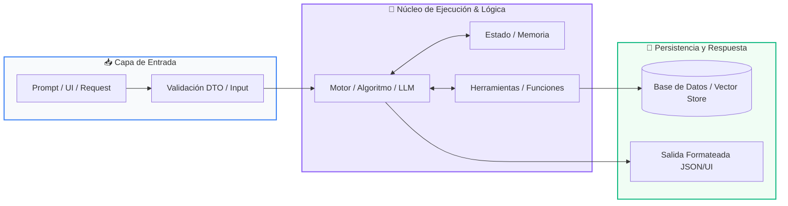

# 📖 Clase 07: Funciones Reutilizables y Modulares

> **Programa:** Curso 1: Fundamentos Básicos de Python (Nivel 1 (Principiantes))  
> **Nivel de Dificultad:** Principiante Absoluto  
> **Metáfora Central:** *«El Electrodoméstico y la Entrega del Cajero»*  
> **Python Version:** 3.10+ | **Licencia:** MIT  

---

## 👤 Acerca del Autor y Mentor

### **William Rodríguez (Wisrovi)**
**AI Solutions Architect & Principal Software Engineer** &bull; *Badajoz, España*

Ingeniero y arquitecto de software especializado en Inteligencia Artificial Generativa, sistemas multi-agente, Visión por Computador e infraestructuras MLOps de alta disponibilidad. Creador y mantenedor de la suite de software libre <strong>wisrovi SUITE</strong> en PyPI con más de 26 bibliotecas enfocadas en orquestación de pipelines, caching distribuido y optimización de bases de datos.

*   🐙 **GitHub:** [github.com/wisrovi](https://github.com/wisrovi)
*   💼 **LinkedIn:** [www.linkedin.com/in/wisrovi-rodriguez/](https://www.linkedin.com/in/wisrovi-rodriguez/)
*   🐳 **DockerHub:** [hub.docker.com/u/wisrovi](https://hub.docker.com/u/wisrovi)
*   🌐 **Website:** [wisrovi.dev](https://wisrovi.dev)
*   📦 **PyPI:** [pypi.org/user/wisrovi/](https://pypi.org/user/wisrovi/)

---

### 🚲 Metodología de Aprendizaje: La Regla de la Bicicleta

> *"Nadie aprende a montar en bicicleta viendo tutoriales. El verdadero dominio de la programación surge cuando abres tu editor, escribes código con tus propias manos, resuelves errores y construyes proyectos reales."*

> [!TIP]
> **El Compromiso Activo del Estudiante:** Abre Visual Studio Code en cada sesión. Escribe cada ejemplo con tus propias manos. Cambia los números, rompe el código deliberadamente para ver el mensaje de error de Python, y luego arréglalo.

---

## 📑 Tabla de Contenidos

| Capítulo | Tema | Enfoque Principal |
| :--- | :--- | :--- |
| **01** | **Fundamentos & Metáfora** | La Modularización y el Principio DRY |
| **02** | **Arquitectura de Flujo** | Caja Negra Funcional y Ámbito de Variables (Scope) |
| **03** | **Implementación Práctica** | Módulo de Facturación con Funciones Tipadas |
| **04** | **Patrones & Debugging** | Gotchas Clásicos con Funciones |
| **05** | **Conclusiones & Cierre** | Resumen ejecutivo, notas del mentor y agradecimiento |
| **06** | **Bibliografía & Recursos** | Fuentes oficiales y retos de autoestudio |

### 🎯 Objetivos de Aprendizaje

*   **Competencia Conceptual:** Comprender el principio DRY (Don't Repeat Yourself), la diferencia entre print y return, y el scope local de variables.
*   **Competencia Práctica:** Escribir funciones modulares, documentadas con docstrings y fuertemente tipadas listas para producción.

---

## 1. 💡 La Modularización y el Principio DRY

El código profesional no se escribe dos veces; cuando una lógica se necesita en múltiples lugares, se encapsula en una función.

> [!NOTE]
> ### 🌟 Metáfora Central: El Electrodoméstico y la Entrega del Cajero
> Una función es como un electrodoméstico: tiene una ranura de entrada (parámetros), un motor interno que realiza una tarea específica, y una bandeja de salida donde entrega el resultado terminado (return).

### Principios Teóricos y Modelo Mental

Parámetros vs Argumentos: Los parámetros son los nombres en la firma (def), los argumentos son los valores reales que pasas al invocarla.

Diferencia crucial: print() solo muestra texto en la pantalla pero devuelve None; return devuelve el valor a la variable que llamó a la función para seguir trabajando con él.

> [!IMPORTANT]
> ### ⚡ Regla de Oro en Python
> Una función debe hacer una sola cosa y hacerla excepcionalmente bien (Principio de Responsabilidad Única).

---

## 2. 🗺️ Caja Negra Funcional y Ámbito de Variables (Scope)

Flujo de invocación, paso de argumentos, aislamiento de variables locales y retorno de valor.

### Diagrama Visual del Flujo



### Desglose Paso a Paso del Flujo

| Fase del Flujo | Acción del Intérprete | Estado en Memoria |
| :--- | :--- | :--- |
| **1. Inicialización** | La función es llamada y se asignan los argumentos a los parámetros. | `Creación del Call Stack Frame` |
| **2. Evaluación** | Se ejecutan las instrucciones en un ámbito local aislado. | `Variables locales temporales` |
| **3. Transformación** | La instrucción 'return' finaliza la ejecución de la función y emite el resultado. | `Envío del valor de retorno` |
| **4. Retorno / Salida** | El stack frame se destruye y la memoria local se libera. | `Retorno al flujo principal` |

> [!TIP]
> **Visualización Mental:** Las variables creadas dentro de una función mueren cuando la función termina: nunca intentes acceder a una variable local desde fuera.

---

## 3. 💻 Módulo de Facturación con Funciones Tipadas

Diseño de funciones modulares con valores por defecto, docstrings y anotaciones de tipo:

```python
# main.py - Python 3.10+ PEP 8 Compliant
def calcular_total_factura(
    subtotal: float,
    tasa_impuesto: float = 0.21,
    descuento: float = 0.0
) -> dict[str, float]:
    """Calcula el desglose final de una factura comercial."""
    monto_descuento = subtotal * descuento
    base_imponible = subtotal - monto_descuento
    impuestos = base_imponible * tasa_impuesto
    total_pagar = base_imponible + impuestos
    
    return {
        "subtotal": subtotal,
        "descuento_aplicado": monto_descuento,
        "impuestos": impuestos,
        "total": round(total_pagar, 2)
    }

# Uso con argumentos por nombre (keyword arguments)
factura = calcular_total_factura(subtotal=150.0, descuento=0.10)
print(f"Total a pagar: ${factura['total']}")
```

### Análisis del Código Fuente

Función pura con parámetros opcionales con valores predeterminados, tipado formal y retorno estructurado en diccionario.

---

## 4. 🛡️ Gotchas Clásicos con Funciones

Errores comunes de diseño y sintaxis en funciones de Python:

> [!WARNING]
> ### ⚠️ Gotcha Frecuente (Trampa de Principiante)
> Usar argumentos mutables por defecto (como def func(lista=[])); la lista se comparte entre llamadas sucesivas.

### Comparativa: Antipatrón vs Patrón Recomendado

#### ❌ Antipatrón / Mal Código:
```python
def agregar(item, lista=[]): # ¡Peligro mutable!
    lista.append(item)
    return lista
```

#### ✅ Patrón Pythonic / Correcto:
```python
def agregar(item, lista=None):
    if lista is None: lista = []
    lista.append(item)
    return lista
```

> [!TIP]
> **Consejo de Resiliencia en Producción:** Usa siempre None como valor predeterminado para parámetros que contengan estructuras mutables.

---

## 5. 🏆 Conclusiones y Resumen Ejecutivo

Dominas el pilar de la abstracción y la reutilización de código mediante funciones profesionales.

> [!NOTE]
> ### 🎖️ Logro Alcanzado
> Capacidad para escribir código limpio, modular, desacoplado y fácil de probar.

### 📝 Notas del Instructor
En la Clase 08 integraremos los 7 temas en un Proyecto Integrador completo: el Gestor de Tareas en Consola.

### 🤝 Mensaje de Agradecimiento
Muchas gracias por tu entusiasmo, disciplina y dedicación al participar en este programa formativo. La programación es un superpoder que transforma vidas cuando se ejerce con constancia y curiosidad. ¡Nos vemos en la próxima sesión para seguir construyendo juntos! 💻🚀

---

## 6. 📚 Bibliografía y Fuentes de Estudio

| Fuente / Recurso | Descripción Temática | Enlace Oficial |
| :--- | :--- | :--- |
| **Documentación Oficial de Python** | Referencia canónica del lenguaje y librería estándar | [docs.python.org/3/](https://docs.python.org/3/) |
| **PEP 8 — Style Guide for Python** | Guía oficial de estilo, formato e indentación | [peps.python.org/pep-0008/](https://peps.python.org/pep-0008/) |
| **Real Python Tutorials** | Artículos técnicos y patrones de desarrollo moderno | [realpython.com](https://realpython.com/) |
| **Python Type Checking (PEP 484)** | Anotaciones de tipo y análisis estático | [docs.python.org/typing](https://docs.python.org/3/library/typing.html) |
| **Suite Open Source wisrovi** | Paquetes Python para orquestación y rendimiento | [github.com/wisrovi](https://github.com/wisrovi) |

> [!TIP]
> ### 🏋️ Desafío de Autoestudio Recomendado
> Escribe una función recursiva que calcule el factorial de un número entero positivo con su caso base bien definido.
