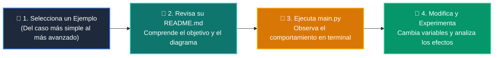

# 💻 Catálogo de Ejemplos Prácticos: Clase 07: Funciones, Parámetros y Scope

> **Ubicación:** `curso/clase-07-funciones/ejemplos`  
> **Filosofía:** *Aprender programando mediante casos de uso aislados, legibles y comentados.*

---

## 🗺️ Flujo de Estudio Recomendado



---

## 📑 Ejemplos Disponibles en esta Clase

| Directorio | Caso de Uso Demostrado | Script Principal |
| :--- | :--- | :---: |
| [`ejemplo_01_funciones_basicas/`](ejemplo_01_funciones_basicas/) | 01 Funciones Basicas | [`main.py`](ejemplo_01_funciones_basicas/main.py) |
| [`ejemplo_02_parametros_por_defecto/`](ejemplo_02_parametros_por_defecto/) | 02 Parametros Por Defecto | [`main.py`](ejemplo_02_parametros_por_defecto/main.py) |
| [`ejemplo_03_scope_legb/`](ejemplo_03_scope_legb/) | 03 Scope Legb | [`main.py`](ejemplo_03_scope_legb/main.py) |
| [`ejemplo_04_args_kwargs/`](ejemplo_04_args_kwargs/) | 04 Args Kwargs | [`main.py`](ejemplo_04_args_kwargs/main.py) |


---

## 🚀 Cómo Ejecutar Cualquier Ejemplo
Abre tu terminal en la raíz del repositorio y ejecuta:
```bash
python 01-fundamentos-python/clase-07-funciones/ejemplos/<nombre_del_ejemplo>/main.py
```
