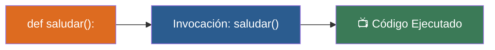

# 📑 Ejemplo 01: El Botón del Juguete (Definir y llamar)

> **Concepto Clave:** Sintaxis def e invocación de funciones.  
> **Metáfora:** El Botón de Sonido: Presionarlo ejecuta la grabación guardada.

---

## 📊 Diagrama de Flujo del Ejemplo



---

## 🏃‍♂️ ¿Cómo ejecutar este ejemplo?

Abre tu terminal en VS Code y ejecuta:

```bash
python 01-fundamentos-python/clase-07-funciones/ejemplos/ejemplo-01-mi-primera-funcion/01_mi_primera_funcion.py
```

---

## 📄 Explicación Paso a Paso

1. Lee detenidamente los comentarios dentro del archivo [`01_mi_primera_funcion.py`](01_mi_primera_funcion.py).
2. Ejecuta el código y observa la salida en consola.
3. Revisa la sección final del archivo para ver el resumen conceptual explicativo.
