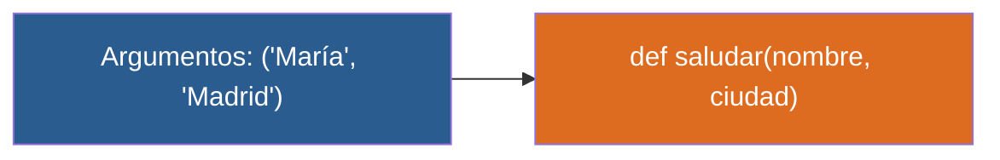

# 📑 Ejemplo 02: Pedir la Pizza (Parámetros y Argumentos)

> **Concepto Clave:** Entrada de variables a funciones mediante parámetros.  
> **Metáfora:** Ingredientes de la pizza: Insumos que le pasas al cocinero.

---

## 📊 Diagrama de Flujo del Ejemplo



---

## 🏃‍♂️ ¿Cómo ejecutar este ejemplo?

Abre tu terminal en VS Code y ejecuta:

```bash
python 01-fundamentos-python/clase-07-funciones/ejemplos/ejemplo-02-parametros-ingredientes/02_parametros_ingredientes.py
```

---

## 📄 Explicación Paso a Paso

1. Lee detenidamente los comentarios dentro del archivo [`02_parametros_ingredientes.py`](02_parametros_ingredientes.py).
2. Ejecuta el código y observa la salida en consola.
3. Revisa la sección final del archivo para ver el resumen conceptual explicativo.
