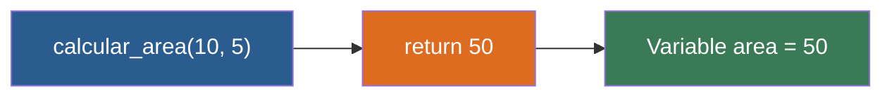

# 📑 Ejemplo 03: El Cajero Automático (return)

> **Concepto Clave:** Devolución de valores mediante return.  
> **Metáfora:** El Cajero Automático: Te entrega el dinero en la mano para guardarlo.

---

## 📊 Diagrama de Flujo del Ejemplo



---

## 🏃‍♂️ ¿Cómo ejecutar este ejemplo?

Abre tu terminal en VS Code y ejecuta:

```bash
python 01-fundamentos-python/clase-07-funciones/ejemplos/ejemplo-03-return-la-entrega/03_return_la_entrega.py
```

---

## 📄 Explicación Paso a Paso

1. Lee detenidamente los comentarios dentro del archivo [`03_return_la_entrega.py`](03_return_la_entrega.py).
2. Ejecuta el código y observa la salida en consola.
3. Revisa la sección final del archivo para ver el resumen conceptual explicativo.
