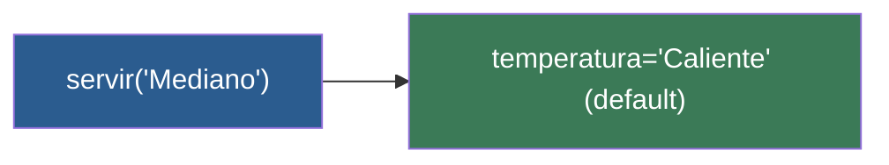

# 📑 Ejemplo 04: El Café Estándar (Parámetros por defecto)

> **Concepto Clave:** Valores predeterminados en parámetros de funciones.  
> **Metáfora:** Café Estándar: Viene caliente a menos que pidas frío.

---

## 📊 Diagrama de Flujo del Ejemplo



---

## 🏃‍♂️ ¿Cómo ejecutar este ejemplo?

Abre tu terminal en VS Code y ejecuta:

```bash
python 01-fundamentos-python/clase-07-funciones/ejemplos/ejemplo-04-valores-por-defecto/04_valores_por_defecto.py
```

---

## 📄 Explicación Paso a Paso

1. Lee detenidamente los comentarios dentro del archivo [`04_valores_por_defecto.py`](04_valores_por_defecto.py).
2. Ejecuta el código y observa la salida en consola.
3. Revisa la sección final del archivo para ver el resumen conceptual explicativo.
