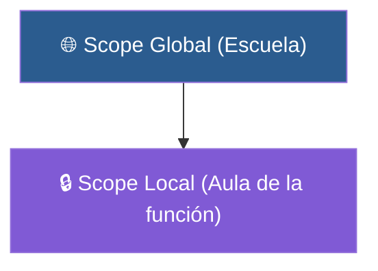

# 📑 Ejemplo 05: Mochila Privada vs Parque Público (Scope)

> **Concepto Clave:** Variables locales vs globales.  
> **Metáfora:** Mochila Privada vs Plaza Pública: Lo local solo existe en la función.

---

## 📊 Diagrama de Flujo del Ejemplo



---

## 🏃‍♂️ ¿Cómo ejecutar este ejemplo?

Abre tu terminal en VS Code y ejecuta:

```bash
python 01-fundamentos-python/clase-07-funciones/ejemplos/ejemplo-05-alcance-scope/05_alcance_scope.py
```

---

## 📄 Explicación Paso a Paso

1. Lee detenidamente los comentarios dentro del archivo [`05_alcance_scope.py`](05_alcance_scope.py).
2. Ejecuta el código y observa la salida en consola.
3. Revisa la sección final del archivo para ver el resumen conceptual explicativo.
