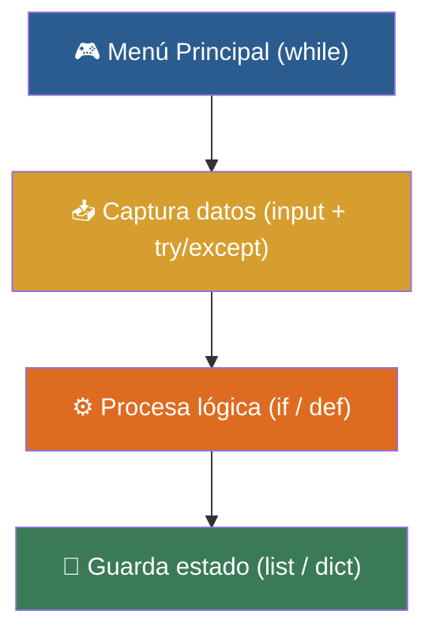

# 🎓 Clase 08: Integración Total - Mi Primer Programa Completo

> **Objetivo:** Integrar todos los conceptos del curso en proyectos interactivos con manejo de errores (try/except).

---

## 💡 Diagrama Conceptual de la Clase

---

## 📚 Ejemplos Prácticos de la Clase

| Ejemplo | Concepto Principal | Metáfora del Mundo Real | Enlace al Material |
| :--- | :--- | :--- | :---: |
| **Ejemplo 01** | Manejo defensivo de excepciones. | *El Casco de Seguridad* | [📁 Ver Ejemplo](ejemplos/ejemplo-01-try-except-el-casco/) |
| **Ejemplo 02** | Menú interactivo en bucle continuo. | *Cajero Automático* | [📁 Ver Ejemplo](ejemplos/ejemplo-02-menu-interactivo-bucle/) |
| **Ejemplo 03** | Integración de Listas, Diccionarios y Funciones. | *Boletín de Notas* | [📁 Ver Ejemplo](ejemplos/ejemplo-03-sistema-notas-estudiantes/) |
| **Ejemplo 04** | Juego interactivo con librería random. | *Juego de Adivinanza* | [📁 Ver Ejemplo](ejemplos/ejemplo-04-juego-adivina-el-numero/) |
| **Ejemplo 05** | Proyecto Integrador Final completo. | *Libreta Digital de Tareas* | [📁 Ver Ejemplo](ejemplos/ejemplo-05-proyecto-gestor-de-tareas/) |

---

## 🏋️ Ejercicio Práctico de la Clase

Revisa la carpeta de [ejercicios/](ejercicios/) para aplicar los conocimientos adquiridos.
