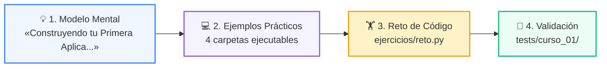
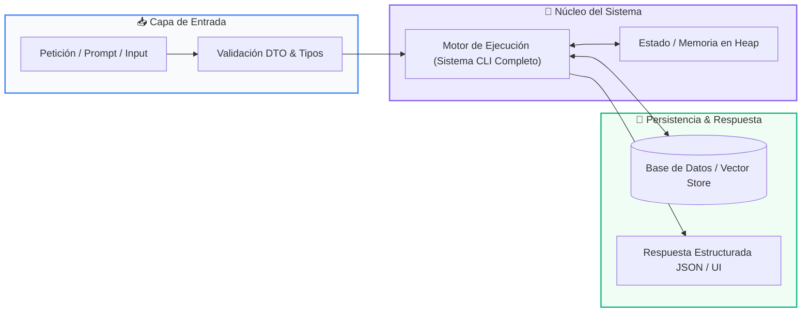

# 📘 Clase 08: Proyecto Integrador: Sistema CLI Completo

> **Curso:** Curso 1: Fundamentos Básicos de Python (CLASE 08)  
> **Nivel:** Nivel 1 - Principiante  
> **Metáfora Central:** *«Construyendo tu Primera Aplicación Real de Consola»*  

---

## 🌀 Posición en el Aprendizaje en Espiral

Esta clase aborda los conceptos clave mediante el ciclo de 3 fases:

1. **💡 Modelo Mental:** Construir tu primera aplicación es como armar tu propia bicicleta: cada pieza encaja para ponerla en marcha.
2. **💻 Experimentación Guiada:** 4+ ejemplos estructurados para correr y depurar.
3. **🏋️ Desafío Práctico:** Reto de consolidación validado con tests.

---

## 🗺️ Arquitectura de la Sesión

---

## 📑 Recursos Disponibles en esta Carpeta

*   📄 [`clase-08-proyecto-integrador-basico.pdf`](clase-08-proyecto-integrador-basico.pdf): Manual técnico oficial en PDF (9 páginas de estudio).
*   📖 [`book.md`](book.md): Libro de estudio digital completo con diagramas Mermaid nativos.
*   📁 [`notebook/`](notebook/): Cuaderno interactivo Jupyter ejecutable en local y en Google Colab con 1 clic.
*   📁 [`ejemplos/`](ejemplos/): 4 carpetas con código fuente funcional y comentado.
*   📁 [`ejercicios/`](ejercicios/): Reto práctico para afianzar conceptos.
