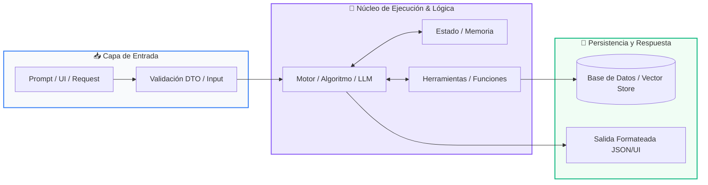

# 📖 Clase 08: Integración Total & Proyecto Integrador

> **Programa:** Curso 1: Fundamentos Básicos de Python (Nivel 1 (Principiantes))  
> **Nivel de Dificultad:** Principiante a Intermedio  
> **Metáfora Central:** *«El Casco de Seguridad y Salir a Rodar en Bici»*  
> **Python Version:** 3.10+ | **Licencia:** MIT  

---

## 👤 Acerca del Autor y Mentor

### **William Rodríguez (Wisrovi)**
**AI Solutions Architect & Principal Software Engineer** &bull; *Badajoz, España*

Ingeniero y arquitecto de software especializado en Inteligencia Artificial Generativa, sistemas multi-agente, Visión por Computador e infraestructuras MLOps de alta disponibilidad. Creador y mantenedor de la suite de software libre <strong>wisrovi SUITE</strong> en PyPI con más de 26 bibliotecas enfocadas en orquestación de pipelines, caching distribuido y optimización de bases de datos.

*   🐙 **GitHub:** [github.com/wisrovi](https://github.com/wisrovi)
*   💼 **LinkedIn:** [www.linkedin.com/in/wisrovi-rodriguez/](https://www.linkedin.com/in/wisrovi-rodriguez/)
*   🐳 **DockerHub:** [hub.docker.com/u/wisrovi](https://hub.docker.com/u/wisrovi)
*   🌐 **Website:** [wisrovi.dev](https://wisrovi.dev)
*   📦 **PyPI:** [pypi.org/user/wisrovi/](https://pypi.org/user/wisrovi/)

---

### 🚲 Metodología de Aprendizaje: La Regla de la Bicicleta

> *"Nadie aprende a montar en bicicleta viendo tutoriales. El verdadero dominio de la programación surge cuando abres tu editor, escribes código con tus propias manos, resuelves errores y construyes proyectos reales."*

> [!TIP]
> **El Compromiso Activo del Estudiante:** Abre Visual Studio Code en cada sesión. Escribe cada ejemplo con tus propias manos. Cambia los números, rompe el código deliberadamente para ver el mensaje de error de Python, y luego arréglalo.

---

## 📑 Tabla de Contenidos

| Capítulo | Tema | Enfoque Principal |
| :--- | :--- | :--- |
| **01** | **Fundamentos & Metáfora** | Arquitectura del Proyecto Integrador: Gestor de Tareas |
| **02** | **Arquitectura de Flujo** | Diagrama de Arquitectura de la Aplicación CLI |
| **03** | **Implementación Práctica** | Implementación del Task Manager CLI |
| **04** | **Patrones & Debugging** | Buenas Prácticas para Proyectos Reales |
| **05** | **Conclusiones & Cierre** | Resumen ejecutivo, notas del mentor y agradecimiento |
| **06** | **Bibliografía & Recursos** | Fuentes oficiales y retos de autoestudio |

### 🎯 Objetivos de Aprendizaje

*   **Competencia Conceptual:** Comprender cómo se interconectan todos los pilares del lenguaje para crear una aplicación funcional y resiliente.
*   **Competencia Práctica:** Construir de principio a fin un sistema de gestión en terminal con menús interactivos, validaciones y persistencia conceptual.

---

## 1. 💡 Arquitectura del Proyecto Integrador: Gestor de Tareas

Llegó el momento de unir todas las piezas: variables, condicionales, bucles, listas, diccionarios y funciones trabajando en armonía.

> [!NOTE]
> ### 🌟 Metáfora Central: El Casco de Seguridad y Salir a Rodar en Bici
> Hasta ahora hemos practicado el equilibrio con las rueditas de entrenamiento. Hoy nos quitamos las rueditas, nos ponemos el casco de seguridad y salimos a rodar en la bicicleta por nosotros mismos en el mundo real.

### Principios Teóricos y Modelo Mental

Patrón de Menú Principal: Un bucle infinito while True mantiene viva la aplicación hasta que el usuario decida salir explícitamente.

Capa de Datos: Una lista de diccionarios en memoria actúa como la base de datos temporal de la aplicación.

> [!IMPORTANT]
> ### ⚡ Regla de Oro en Python
> Separa la presentación (print, input) de la lógica de negocio (las funciones que agregan, buscan y transforman datos).

---

## 2. 🗺️ Diagrama de Arquitectura de la Aplicación CLI

Interacción entre la capa de interfaz de consola, el enrutador de comandos y el modelo de datos.

### Diagrama Visual del Flujo



### Desglose Paso a Paso del Flujo

| Fase del Flujo | Acción del Intérprete | Estado en Memoria |
| :--- | :--- | :--- |
| **1. Inicialización** | Bucle principal muestra el menú de opciones (1. Agregar, 2. Listar, 3. Completar, 4. Salir). | `Esperando opción del usuario` |
| **2. Evaluación** | Enrutador if/elif invoca la función específica según la opción elegida. | `Despacho a función modular` |
| **3. Transformación** | La función ejecuta la operación CRUD sobre la lista de tareas en memoria. | `Actualización del estado` |
| **4. Retorno / Salida** | Se muestra retroalimentación visual al usuario y se reinicia el ciclo del menú. | `Ciclo listo para nueva orden` |

> [!TIP]
> **Visualización Mental:** Esta arquitectura modular en consola es idéntica en concepto a los controladores y servicios de las APIs web modernas.

---

## 3. 💻 Implementación del Task Manager CLI

Estructura modular del proyecto integrador con funciones CRUD completas:

```python
# main.py - Python 3.10+ PEP 8 Compliant
tareas: list[dict] = []

def agregar_tarea(titulo: str) -> None:
    nueva_tarea = {"id": len(tareas) + 1, "titulo": titulo, "completada": False}
    tareas.append(nueva_tarea)
    print(f"✅ Tarea #{nueva_tarea['id']} agregada con éxito.")

def listar_tareas() -> None:
    if not tareas:
        print("📭 No hay tareas registradas.")
        return
    for t in tareas:
        estado = "✔️ [LISTA]" if t["completada"] else "⏳ [PENDIENTE]"
        print(f"#{t['id']} - {t['titulo']} {estado}")

def completar_tarea(id_tarea: int) -> None:
    for t in tareas:
        if t["id"] == id_tarea:
            t["completada"] = True
            print(f"🎉 Tarea #{id_tarea} marcada como completada.")
            return
    print("❌ ID de tarea no encontrado.")
```

### Análisis del Código Fuente

Sistema modular que implementa el ciclo CRUD completo, demostrando el dominio integral de las estructuras de datos y funciones.

---

## 4. 🛡️ Buenas Prácticas para Proyectos Reales

Reglas de oro para dar el salto de principiante a desarrollador junior estructurado:

> [!WARNING]
> ### ⚠️ Gotcha Frecuente (Trampa de Principiante)
> Escribir código espagueti con cientos de líneas sin funciones y mezclando variables globales descontroladas.

### Comparativa: Antipatrón vs Patrón Recomendado

#### ❌ Antipatrón / Mal Código:
```python
# Código monolítico sin funciones ni modularidad
while True:
    op = input()
    # 300 líneas de if/else anidados sin separación
```

#### ✅ Patrón Pythonic / Correcto:
```python
# Código desacoplado
def main():
    while True:
        mostrar_menu()
        procesar_opcion()
```

> [!TIP]
> **Consejo de Resiliencia en Producción:** Encapsula siempre el punto de entrada de tu programa dentro de if __name__ == '__main__': main().

---

## 5. 🏆 Conclusiones y Resumen Ejecutivo

¡Felicitaciones! Has completado con éxito el Curso 1 de Fundamentos de Python. Has pasado de cero a programador activo.

> [!NOTE]
> ### 🎖️ Logro Alcanzado
> Creación y comprensión integral de tu primera aplicación de software estructurada en Python.

### 📝 Notas del Instructor
En el Curso 2 daremos el salto a Algoritmos Avanzados, Notación Big-O, Pilas, Colas, Búsqueda Binaria y Optimización.

### 🤝 Mensaje de Agradecimiento
Muchas gracias por tu entusiasmo, disciplina y dedicación al participar en este programa formativo. La programación es un superpoder que transforma vidas cuando se ejerce con constancia y curiosidad. ¡Nos vemos en la próxima sesión para seguir construyendo juntos! 💻🚀

---

## 6. 📚 Bibliografía y Fuentes de Estudio

| Fuente / Recurso | Descripción Temática | Enlace Oficial |
| :--- | :--- | :--- |
| **Documentación Oficial de Python** | Referencia canónica del lenguaje y librería estándar | [docs.python.org/3/](https://docs.python.org/3/) |
| **PEP 8 — Style Guide for Python** | Guía oficial de estilo, formato e indentación | [peps.python.org/pep-0008/](https://peps.python.org/pep-0008/) |
| **Real Python Tutorials** | Artículos técnicos y patrones de desarrollo moderno | [realpython.com](https://realpython.com/) |
| **Python Type Checking (PEP 484)** | Anotaciones de tipo y análisis estático | [docs.python.org/typing](https://docs.python.org/3/library/typing.html) |
| **Suite Open Source wisrovi** | Paquetes Python para orquestación y rendimiento | [github.com/wisrovi](https://github.com/wisrovi) |

> [!TIP]
> ### 🏋️ Desafío de Autoestudio Recomendado
> Agrega la función para guardar y cargar las tareas en un archivo JSON en disco para tener persistencia real.
