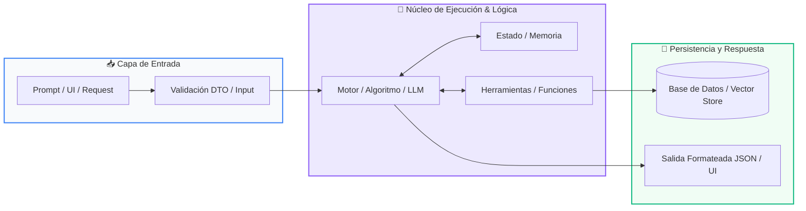

# 📚 Clase 08: Proyecto Integrador: Sistema CLI Completo

> **Programa:** Curso 1: Fundamentos Básicos de Python  
> **Nivel:** Nivel 1 - Principiante  
> **Metáfora Central:** *«Construyendo tu Primera Aplicación Real de Consola»*  
> **Documento Oficial PDF:** [clase-08-proyecto-integrador-basico.pdf](clase-08-proyecto-integrador-basico.pdf)  
> **Instructor:** **William Rodríguez (Wisrovi)** (AI Solutions Architect & Principal Software Engineer)  

---

## 👤 Perfil del Autor y Mentor

### **William Rodríguez (Wisrovi)**
*AI Solutions Architect & Principal Software Engineer &bull; Badajoz, España*

Ingeniero y arquitecto de software especializado en Inteligencia Artificial Generativa, sistemas multi-agente, Visión por Computador e infraestructuras MLOps de alta disponibilidad. Creador y mantenedor de la suite de software libre wisrovi SUITE en PyPI con más de 26 bibliotecas enfocadas en orquestación de pipelines, caching distribuido y optimización de bases de datos.

*   🐙 **GitHub:** [github.com/wisrovi](https://github.com/wisrovi)
*   💼 **LinkedIn:** [www.linkedin.com/in/wisrovi-rodriguez/](https://www.linkedin.com/in/wisrovi-rodriguez/)
*   🐳 **DockerHub:** [hub.docker.com/u/wisrovi](https://hub.docker.com/u/wisrovi)
*   🌐 **Website:** [wisrovi.dev](https://wisrovi.dev)
*   📦 **PyPI:** [pypi.org/user/wisrovi/](https://pypi.org/user/wisrovi/)

---

### 🚲 La Regla de la Bicicleta

> *"Nadie aprende a montar en bicicleta viendo tutoriales. El verdadero dominio de la programación surge cuando abres tu editor, escribes código con tus propias manos, resuelves errores y construyes proyectos reales."*

---

## 📑 Tabla de Contenidos de la Sesión

1. [💡 Fundamentación Teórica y Modelo Mental](#1--fundamentación-teórica-y-modelo-mental)
2. [🗺️ Arquitectura y Diagrama de Flujo](#2-️-arquitectura-y-diagrama-de-flujo)
3. [💻 Implementación en Python 3.10+](#3--implementación-en-python-310)
4. [🛡️ Buenas Prácticas y Trampas Frecuentes](#4-️-buenas-prácticas-y-trampas-frecuentes)
5. [🏋️ Desafío de Práctica](#5-️-desafío-de-práctica)
6. [📚 Bibliografía y Enlaces Canónicos](#6--bibliografía-y-enlaces-canónicos)

---

## 1. 💡 Fundamentación Teórica y Modelo Mental

El proyecto integrador une todos los conocimientos adquiridos en el Curso 1 para crear una herramienta real.

> [!NOTE]
> **🌟 Metáfora Didáctica:** Construir tu primera aplicación es como armar tu propia bicicleta: cada pieza encaja para ponerla en marcha.

### Principios Fundamentales

Arquitectura modular: Separación de la interfaz de consola de la lógica de negocio.

Manejo de excepciones: Asegurar que entradas inválidas no detengan el programa.

> [!IMPORTANT]
> **⚡ Regla de Oro en Python:** Estructura siempre tu punto de entrada con el patrón estándar if __name__ == '__main__':.

---

## 2. 🗺️ Arquitectura y Diagrama de Flujo

Arquitectura del bucle principal de eventos del sistema CLI.



### Desglose Paso a Paso del Flujo

| Fase | Acción del Intérprete | Estado en Memoria |
| :--- | :--- | :--- |
| **1. Inicialización** | Inicialización del estado en memoria. | `Colección de tareas activa.` |
| **2. Evaluación** | Despliegue del menú y captura de opción. | `Espera de input en stdin.` |
| **3. Transformación** | Despacho a la función correspondiente. | `Mutación controlada.` |
| **4. Retorno / Salida** | Confirmación visual y repetición del ciclo. | `Bucle activo hasta salir.` |

> [!TIP]
> **🔍 Visualización Mental:** Cada opción del menú debe llamar a una función especializada e independiente.

---

## 3. 💻 Implementación en Python 3.10+

```python
# CLASE 08 - Código de Demostración
class TaskManager:
    def __init__(self):
        self.tasks = []

    def add_task(self, title: str):
        self.tasks.append({"id": len(self.tasks) + 1, "title": title, "done": False})

    def list_tasks(self):
        return self.tasks

tm = TaskManager()
tm.add_task("Aprender Python con Wisrovi")
print("Tareas registradas:", tm.list_tasks())
```

*Uso de clases, métodos encapsulados, listas de diccionarios y formateo de salida.*

---

## 4. 🛡️ Buenas Prácticas y Trampas Frecuentes

> [!WARNING]
> **⚠️ Gotcha Frecuente (Trampa de Principiante):** Escribir todo el código en un solo archivo plano sin funciones ni modularidad.

*   **❌ Antipatrón:**
    ```python
# 500 líneas de código plano desordenado ❌
    ```

*   **✅ Patrón Correcto:**
    ```python
# Funciones modulares y clases con responsabilidades únicas ✅
    ```

> [!TIP]
> **💡 Consejo Profesional:** Documenta tus scripts con un README claro explicando cómo ejecutar la aplicación.

---

## 5. 🏋️ Desafío de Práctica

> **Desafío:** Amplía el TaskManager para permitir marcar tareas como completadas y eliminarlas por ID.

Para ejecutar la verificación automática con pytest:
```bash
pytest ejercicios/
```

---

## 6. 📚 Bibliografía y Enlaces Canónicos

| Fuente / Recurso | Descripción | Enlace |
| :--- | :--- | :--- |
| **Documentación Oficial de Python** | Especificación y biblioteca estándar | [docs.python.org/3/](https://docs.python.org/3/) |
| **PEP 8 — Style Guide for Python** | Estándar oficial de formateo y estilo | [peps.python.org/pep-0008/](https://peps.python.org/pep-0008/) |
| **Real Python Tutorials** | Patrones de ingeniería y desarrollo | [realpython.com](https://realpython.com/) |
| **Suite Open Source wisrovi** | Librerías de alto rendimiento | [github.com/wisrovi](https://github.com/wisrovi) |
