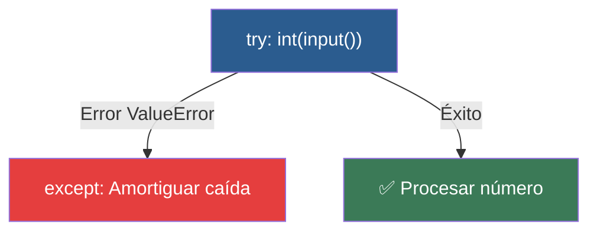

# 📑 Ejemplo 01: El Casco de Seguridad (try / except)

> **Concepto Clave:** Manejo defensivo de excepciones.  
> **Metáfora:** El Casco de Seguridad: Amortiguar una caída si el usuario comete un error.

---

## 📊 Diagrama de Flujo del Ejemplo



---

## 🏃‍♂️ ¿Cómo ejecutar este ejemplo?

Abre tu terminal en VS Code y ejecuta:

```bash
python 01-fundamentos-python/clase-08-proyecto-integrador-basico/ejemplos/ejemplo-01-try-except-el-casco/01_try_except_el_casco.py
```

---

## 📄 Explicación Paso a Paso

1. Lee detenidamente los comentarios dentro del archivo [`01_try_except_el_casco.py`](01_try_except_el_casco.py).
2. Ejecuta el código y observa la salida en consola.
3. Revisa la sección final del archivo para ver el resumen conceptual explicativo.
