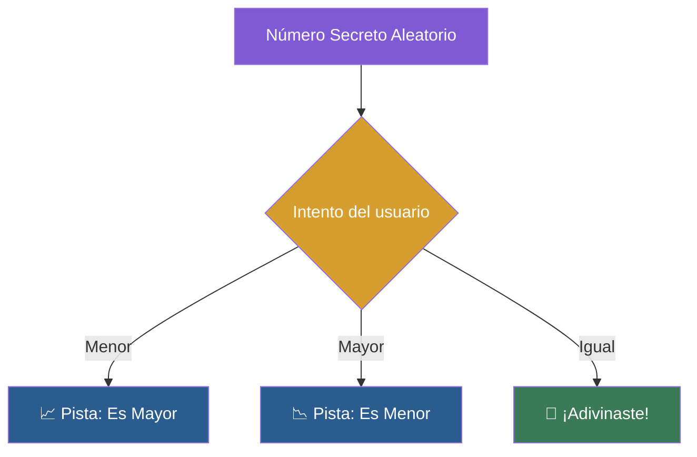

# 📑 Ejemplo 04: Adivina el Número Secreto

> **Concepto Clave:** Juego interactivo con librería random.  
> **Metáfora:** Juego de Adivinanza: Pistas de mayor/menor hasta acertar.

---

## 📊 Diagrama de Flujo del Ejemplo



---

## 🏃‍♂️ ¿Cómo ejecutar este ejemplo?

Abre tu terminal en VS Code y ejecuta:

```bash
python 01-fundamentos-python/clase-08-proyecto-integrador-basico/ejemplos/ejemplo-04-juego-adivina-el-numero/04_juego_adivina_el_numero.py
```

---

## 📄 Explicación Paso a Paso

1. Lee detenidamente los comentarios dentro del archivo [`04_juego_adivina_el_numero.py`](04_juego_adivina_el_numero.py).
2. Ejecuta el código y observa la salida en consola.
3. Revisa la sección final del archivo para ver el resumen conceptual explicativo.
