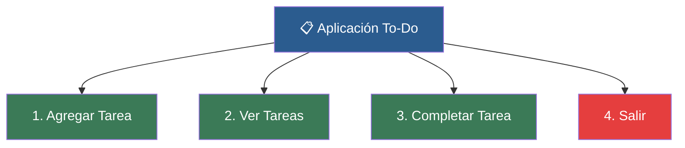

# 📑 Ejemplo 05: Aplicación Gestor de Tareas To-Do

> **Concepto Clave:** Proyecto Integrador Final completo.  
> **Metáfora:** Libreta Digital de Tareas: Crear, listar y completar pendientes.

---

## 📊 Diagrama de Flujo del Ejemplo



---

## 🏃‍♂️ ¿Cómo ejecutar este ejemplo?

Abre tu terminal en VS Code y ejecuta:

```bash
python 01-fundamentos-python/clase-08-proyecto-integrador-basico/ejemplos/ejemplo-05-proyecto-gestor-de-tareas/05_proyecto_gestor_de_tareas.py
```

---

## 📄 Explicación Paso a Paso

1. Lee detenidamente los comentarios dentro del archivo [`05_proyecto_gestor_de_tareas.py`](05_proyecto_gestor_de_tareas.py).
2. Ejecuta el código y observa la salida en consola.
3. Revisa la sección final del archivo para ver el resumen conceptual explicativo.
