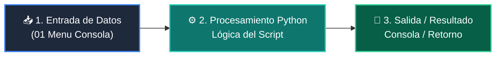

# 📖 01 Menu Consola

> **Clase:** Clase 08: Proyecto Integrador: Sistema CLI Completo  
> **Script:** [`main.py`](main.py)  

Ejemplo 01: Bucle de Menú de Consola.

---

## 🗺️ Flujo de Ejecución del Ejemplo



---

## 💻 Ejecución desde Terminal

```bash
python 01-fundamentos-python/clase-08-proyecto-integrador-basico/ejemplos/ejemplo_01_menu_consola/main.py
```
