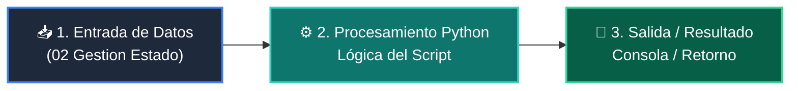

# 📖 02 Gestion Estado

> **Clase:** Clase 08: Proyecto Integrador: Sistema CLI Completo  
> **Script:** [`main.py`](main.py)  

Ejemplo 02: Clase de Estado TaskManager.

---

## 🗺️ Flujo de Ejecución del Ejemplo



---

## 💻 Ejecución desde Terminal

```bash
python 01-fundamentos-python/clase-08-proyecto-integrador-basico/ejemplos/ejemplo_02_gestion_estado/main.py
```
