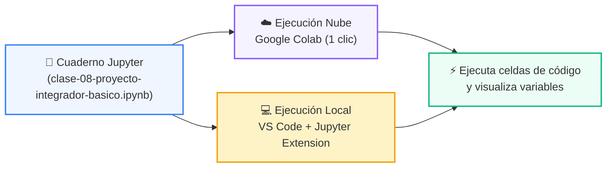

# 📓 Cuaderno Interactivo: Clase 08: Proyecto Integrador: Sistema CLI Completo

> **Curso:** 01-fundamentos-python  
> **Archivo:** [`clase-08-proyecto-integrador-basico.ipynb`](clase-08-proyecto-integrador-basico.ipynb)  

---

## 🌀 Modelo de Aprendizaje Celda a Celda

Los cuadernos Jupyter permiten experimentar de forma inmediata:

---

## 🚀 Cómo Utilizar este Cuaderno
*   **En la Nube:** Haz clic en el botón superior **Open in Colab** para ejecutarlo sin instalar nada.
*   **En Local:** Abre [`clase-08-proyecto-integrador-basico.ipynb`](clase-08-proyecto-integrador-basico.ipynb) directamente en Visual Studio Code.
