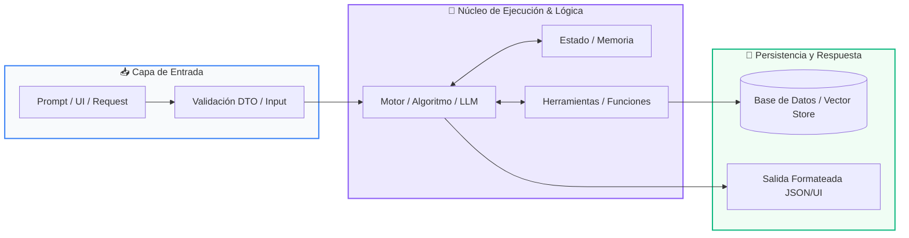

# 📖 Módulo 01: Estructuras de Datos Avanzadas

> **Programa:** Curso 2: Algoritmos Avanzados y Estructuras de Datos (Nivel 2 (Intermedio))  
> **Nivel de Dificultad:** Intermedio  
> **Metáfora Central:** *«Pilas LIFO, Colas FIFO y Árboles Jerárquicos»*  
> **Python Version:** 3.10+ | **Licencia:** MIT  

---

## 👤 Acerca del Autor y Mentor

### **William Rodríguez (Wisrovi)**
**AI Solutions Architect & Principal Software Engineer** &bull; *Badajoz, España*

Ingeniero y arquitecto de software especializado en Inteligencia Artificial Generativa, sistemas multi-agente, Visión por Computador e infraestructuras MLOps de alta disponibilidad. Creador y mantenedor de la suite de software libre <strong>wisrovi SUITE</strong> en PyPI con más de 26 bibliotecas enfocadas en orquestación de pipelines, caching distribuido y optimización de bases de datos.

*   🐙 **GitHub:** [github.com/wisrovi](https://github.com/wisrovi)
*   💼 **LinkedIn:** [www.linkedin.com/in/wisrovi-rodriguez/](https://www.linkedin.com/in/wisrovi-rodriguez/)
*   🐳 **DockerHub:** [hub.docker.com/u/wisrovi](https://hub.docker.com/u/wisrovi)
*   🌐 **Website:** [wisrovi.dev](https://wisrovi.dev)
*   📦 **PyPI:** [pypi.org/user/wisrovi/](https://pypi.org/user/wisrovi/)

---

### 🚲 Metodología de Aprendizaje: La Regla de la Bicicleta

> *"Nadie aprende a montar en bicicleta viendo tutoriales. El verdadero dominio de la programación surge cuando abres tu editor, escribes código con tus propias manos, resuelves errores y construyes proyectos reales."*

> [!TIP]
> **El Compromiso Activo del Estudiante:** Abre Visual Studio Code en cada sesión. Escribe cada ejemplo con tus propias manos. Cambia los números, rompe el código deliberadamente para ver el mensaje de error de Python, y luego arréglalo.

---

## 📑 Tabla de Contenidos

| Capítulo | Tema | Enfoque Principal |
| :--- | :--- | :--- |
| **01** | **Fundamentos & Metáfora** | Estructuras Lineales y Jerárquicas en Memoria |
| **02** | **Arquitectura de Flujo** | Comparativa Visual: Pila (LIFO) vs Cola (FIFO) |
| **03** | **Implementación Práctica** | Validador de Paréntesis Balanceados con Pilas |
| **04** | **Patrones & Debugging** | Gotchas y Optimización de Estructuras |
| **05** | **Conclusiones & Cierre** | Resumen ejecutivo, notas del mentor y agradecimiento |
| **06** | **Bibliografía & Recursos** | Fuentes oficiales y retos de autoestudio |

### 🎯 Objetivos de Aprendizaje

*   **Competencia Conceptual:** Comprender las disciplinas de acceso LIFO y FIFO y el coste temporal O(1) vs O(n) en memoria.
*   **Competencia Práctica:** Implementar pilas para validación sintáctica, colas para buffers de tareas y árboles binarios para búsqueda rápida.

---

## 1. 💡 Estructuras Lineales y Jerárquicas en Memoria

Las listas básicas no siempre son la estructura óptima cuando la velocidad de inserción y extracción en los extremos es crítica.

> [!NOTE]
> ### 🌟 Metáfora Central: Pilas LIFO, Colas FIFO y Árboles Jerárquicos
> Una Pila (Stack) es como una pila de platos: el último que colocas arriba es el primero que lavas (LIFO: Last In, First Out). Una Cola (Queue) es como la fila del supermercado: el primero que llega es el primero en ser atendido (FIFO: First In, First Out).

### Principios Teóricos y Modelo Mental

collections.deque en Python permite inserciones y extracciones O(1) tanto por la izquierda como por la derecha, a diferencia de list.pop(0) que cuesta O(n).

Los conjuntos (sets) implementan álgebra de conjuntos (unión, intersección, diferencia) con consultas O(1) y garantizan elementos únicos.

> [!IMPORTANT]
> ### ⚡ Regla de Oro en Python
> Para colas FIFO de alto rendimiento en Python, utiliza siempre collections.deque en lugar de listas estándar.

---

## 2. 🗺️ Comparativa Visual: Pila (LIFO) vs Cola (FIFO)

Mecanismos de inserción (push/enqueue) y extracción (pop/dequeue) en memoria:

### Diagrama Visual del Flujo



### Desglose Paso a Paso del Flujo

| Fase del Flujo | Acción del Intérprete | Estado en Memoria |
| :--- | :--- | :--- |
| **1. Inicialización** | Operación Push / Enqueue: Ingreso de nuevo elemento. | `Elemento en memoria` |
| **2. Evaluación** | En Stack (LIFO): Se coloca en el tope y se extrae del tope. | `Último en entrar = Primero en salir` |
| **3. Transformación** | En Queue (FIFO): Se ingresa por la cola y se extrae por la cabeza. | `Primero en entrar = Primero en salir` |
| **4. Retorno / Salida** | Árboles: Ramifican decisiones jerárquicas izquierda/derecha. | `Acceso logarítmico O(log n)` |

> [!TIP]
> **Visualización Mental:** Las pilas gestionan llamadas de funciones y el botón Deshacer (Ctrl+Z); las colas gestionan mensajes y colas de impresión.

---

## 3. 💻 Validador de Paréntesis Balanceados con Pilas

Algoritmo clásico de entrevistas técnicas implementado con una Pila LIFO:

```python
# main.py - Python 3.10+ PEP 8 Compliant
def validar_parentesis(expresion: str) -> bool:
    pila: list[str] = []
    pares = {")": "(", "}": "{", "]": "["}
    
    for char in expresion:
        if char in pares.values():
            pila.append(char) # Push
        elif char in pares:
            if not pila or pila.pop() != pares[char]: # Pop & Check
                return False
                
    return len(pila) == 0

# Pruebas
print(validar_parentesis("{[()()]}"))  # True
print(validar_parentesis("{[(])}"))    # False
```

### Análisis del Código Fuente

El algoritmo apila los caracteres de apertura y los desapila al encontrar cierres, garantizando correspondencia simétrica en O(n).

---

## 4. 🛡️ Gotchas y Optimización de Estructuras

Errores de rendimiento habituales al elegir estructuras de datos:

> [!WARNING]
> ### ⚠️ Gotcha Frecuente (Trampa de Principiante)
> Usar list.pop(0) para implementar una cola; obliga a desplazar todos los elementos restantes en memoria generando complejidad O(n).

### Comparativa: Antipatrón vs Patrón Recomendado

#### ❌ Antipatrón / Mal Código:
```python
cola = []
cola.insert(0, item) # O(n) en cada inserción
```

#### ✅ Patrón Pythonic / Correcto:
```python
from collections import deque
cola = deque()
cola.append(item) # O(1) instantáneo
```

> [!TIP]
> **Consejo de Resiliencia en Producción:** Usa sets para eliminar duplicados de una lista en una sola operación: unicos = list(set(datos)).

---

## 5. 🏆 Conclusiones y Resumen Ejecutivo

Dominas las estructuras de datos fundamentales para diseñar software de alta concurrencia y algoritmos eficientes.

> [!NOTE]
> ### 🎖️ Logro Alcanzado
> Capacidad para elegir la estructura de datos óptima según los requerimientos de tiempo y espacio.

### 📝 Notas del Instructor
En el siguiente módulo aprenderemos Búsqueda Binaria, Algoritmos de Ordenamiento y Notación Big-O.

### 🤝 Mensaje de Agradecimiento
Muchas gracias por tu entusiasmo, disciplina y dedicación al participar en este programa formativo. La programación es un superpoder que transforma vidas cuando se ejerce con constancia y curiosidad. ¡Nos vemos en la próxima sesión para seguir construyendo juntos! 💻🚀

---

## 6. 📚 Bibliografía y Fuentes de Estudio

| Fuente / Recurso | Descripción Temática | Enlace Oficial |
| :--- | :--- | :--- |
| **Documentación Oficial de Python** | Referencia canónica del lenguaje y librería estándar | [docs.python.org/3/](https://docs.python.org/3/) |
| **PEP 8 — Style Guide for Python** | Guía oficial de estilo, formato e indentación | [peps.python.org/pep-0008/](https://peps.python.org/pep-0008/) |
| **Real Python Tutorials** | Artículos técnicos y patrones de desarrollo moderno | [realpython.com](https://realpython.com/) |
| **Python Type Checking (PEP 484)** | Anotaciones de tipo y análisis estático | [docs.python.org/typing](https://docs.python.org/3/library/typing.html) |
| **Suite Open Source wisrovi** | Paquetes Python para orquestación y rendimiento | [github.com/wisrovi](https://github.com/wisrovi) |

> [!TIP]
> ### 🏋️ Desafío de Autoestudio Recomendado
> Implementa una cola de prioridad utilizando el módulo heapq de Python para despachar tareas según su urgencia.
