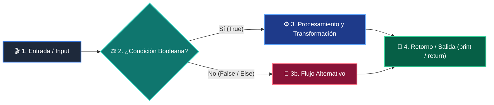

# 📖 Módulo 02: Ordenamiento, Búsqueda y Big-O

> **Programa:** Curso 2: Algoritmos Avanzados y Estructuras de Datos (Nivel 2 (Intermedio))  
> **Nivel de Dificultad:** Intermedio  
> **Metáfora Central:** *«El Diccionario por la Mitad y Divide y Vencerás»*  
> **Python Version:** 3.10+ | **Licencia:** MIT  

---

## 👤 Acerca del Autor y Mentor

### **William Rodríguez (Wisrovi)**
**AI Solutions Architect & Principal Software Engineer** &bull; *Badajoz, España*

Ingeniero y arquitecto de software especializado en Inteligencia Artificial Generativa, sistemas multi-agente, Visión por Computador e infraestructuras MLOps de alta disponibilidad. Creador y mantenedor de la suite de software libre <strong>wisrovi SUITE</strong> en PyPI con más de 26 bibliotecas enfocadas en orquestación de pipelines, caching distribuido y optimización de bases de datos.

*   🐙 **GitHub:** [github.com/wisrovi](https://github.com/wisrovi)
*   💼 **LinkedIn:** [www.linkedin.com/in/wisrovi-rodriguez/](https://www.linkedin.com/in/wisrovi-rodriguez/)
*   🐳 **DockerHub:** [hub.docker.com/u/wisrovi](https://hub.docker.com/u/wisrovi)
*   🌐 **Website:** [wisrovi.dev](https://wisrovi.dev)
*   📦 **PyPI:** [pypi.org/user/wisrovi/](https://pypi.org/user/wisrovi/)

---

### 🚲 Metodología de Aprendizaje: La Regla de la Bicicleta

> *"Nadie aprende a montar en bicicleta viendo tutoriales. El verdadero dominio de la programación surge cuando abres tu editor, escribes código con tus propias manos, resuelves errores y construyes proyectos reales."*

> [!TIP]
> **El Compromiso Activo del Estudiante:** Abre Visual Studio Code en cada sesión. Escribe cada ejemplo con tus propias manos. Cambia los números, rompe el código deliberadamente para ver el mensaje de error de Python, y luego arréglalo.

---

## 📑 Tabla de Contenidos

| Capítulo | Tema | Enfoque Principal |
| :--- | :--- | :--- |
| **01** | **Fundamentos & Metáfora** | Notación Asintótica Big-O y Complejidad |
| **02** | **Arquitectura de Flujo** | Diagrama de Búsqueda Binaria (Divide & Conquer) |
| **03** | **Implementación Práctica** | Búsqueda Binaria y QuickSort en Python |
| **04** | **Patrones & Debugging** | Gotchas en Algoritmos de Búsqueda |
| **05** | **Conclusiones & Cierre** | Resumen ejecutivo, notas del mentor y agradecimiento |
| **06** | **Bibliografía & Recursos** | Fuentes oficiales y retos de autoestudio |

### 🎯 Objetivos de Aprendizaje

*   **Competencia Conceptual:** Comprender cómo escala el tiempo de ejecución a medida que el tamaño de entrada (n) crece hacia el infinito.
*   **Competencia Práctica:** Implementar búsqueda binaria y entender la estrategia 'Divide y Vencerás' de QuickSort frente a BubbleSort.

---

## 1. 💡 Notación Asintótica Big-O y Complejidad

En software la velocidad no se mide en segundos, sino en cómo crece el número de operaciones en función del volumen de datos (n).

> [!NOTE]
> ### 🌟 Metáfora Central: El Diccionario por la Mitad y Divide y Vencerás
> Si buscas una palabra en un diccionario de 1,000 páginas hojeando página por página (búsqueda lineal), puedes tardar 1,000 pasos. Si abres el diccionario por la mitad exacta y descartas la mitad irrelevante (búsqueda binaria), encontrarás la palabra en solo 10 pasos.

### Principios Teóricos y Modelo Mental

Escalas de Complejidad: O(1) Constante < O(log n) Logarítmica < O(n) Lineal < O(n log n) Casi-lineal < O(n^2) Cuadrática.

Búsqueda Binaria requiere que la colección esté previamente ordenada para garantizar reducción del espacio de búsqueda a la mitad.

> [!IMPORTANT]
> ### ⚡ Regla de Oro en Python
> Evita los bucles anidados innecesarios: dos bucles anidados sobre n elementos convierten un algoritmo de O(n) a O(n^2).

---

## 2. 🗺️ Diagrama de Búsqueda Binaria (Divide & Conquer)

Estrategia de reducción logarítmica del intervalo de búsqueda con punteros low, mid y high.

### Diagrama Visual del Flujo



### Desglose Paso a Paso del Flujo

| Fase del Flujo | Acción del Intérprete | Estado en Memoria |
| :--- | :--- | :--- |
| **1. Inicialización** | Calcula el punto medio: mid = (low + high) // 2. | `low=0, high=n-1, mid` |
| **2. Evaluación** | Compara el elemento en 'mid' con el objetivo buscado. | `Evalúa igualdad` |
| **3. Transformación** | Si objetivo < array[mid], descarta la mitad derecha ajustando high = mid - 1. | `Espacio reducido al 50%` |
| **4. Retorno / Salida** | Si objetivo > array[mid], descarta la mitad izquierda ajustando low = mid + 1. | `Repite hasta converger` |

> [!TIP]
> **Visualización Mental:** La búsqueda binaria puede encontrar un registro entre 4 mil millones de elementos en tan solo 32 comparaciones.

---

## 3. 💻 Búsqueda Binaria y QuickSort en Python

Implementación idiomática de búsqueda binaria y particionado recursivo QuickSort:

```python
# main.py - Python 3.10+ PEP 8 Compliant
def busqueda_binaria(lista: list[int], objetivo: int) -> int:
    low, high = 0, len(lista) - 1
    while low <= high:
        mid = (low + high) // 2
        if lista[mid] == objetivo:
            return mid # Encontrado
        elif lista[mid] < objetivo:
            low = mid + 1
        else:
            high = mid - 1
    return -1 # No existe

def quicksort(arr: list[int]) -> list[int]:
    if len(arr) <= 1:
        return arr
    pivote = arr[len(arr) // 2]
    izq = [x for x in arr if x < pivote]
    centro = [x for x in arr if x == pivote]
    der = [x for x in arr if x > pivote]
    return quicksort(izq) + centro + quicksort(der)
```

### Análisis del Código Fuente

Búsqueda Binaria O(log n) combinada con QuickSort O(n log n) basado en listas por comprensión.

---

## 4. 🛡️ Gotchas en Algoritmos de Búsqueda

Errores clásicos al implementar algoritmos de búsqueda y ordenamiento:

> [!WARNING]
> ### ⚠️ Gotcha Frecuente (Trampa de Principiante)
> Ejecutar búsqueda binaria sobre una lista no ordenada; produce falsos negativos y resultados erráticos.

### Comparativa: Antipatrón vs Patrón Recomendado

#### ❌ Antipatrón / Mal Código:
```python
desordenada = [9, 1, 5, 2]
busqueda_binaria(desordenada, 5) # ¡Falla!
```

#### ✅ Patrón Pythonic / Correcto:
```python
ordenada = sorted(desordenada)
busqueda_binaria(ordenada, 5) # Retorna índice correcto
```

> [!TIP]
> **Consejo de Resiliencia en Producción:** Python utiliza Timsort (híbrido de MergeSort e InsertionSort) en lista.sort(), el cual tiene complejidad garantizada O(n log n).

---

## 5. 🏆 Conclusiones y Resumen Ejecutivo

Comprendes el impacto exponencial de los algoritmos en el rendimiento y dominas las técnicas de ordenamiento y búsqueda.

> [!NOTE]
> ### 🎖️ Logro Alcanzado
> Capacidad para analizar la complejidad temporal de algoritmos y optimizar cuellos de botella.

### 📝 Notas del Instructor
En el siguiente módulo exploraremos la Recursividad y la Programación Dinámica con Memoización.

### 🤝 Mensaje de Agradecimiento
Muchas gracias por tu entusiasmo, disciplina y dedicación al participar en este programa formativo. La programación es un superpoder que transforma vidas cuando se ejerce con constancia y curiosidad. ¡Nos vemos en la próxima sesión para seguir construyendo juntos! 💻🚀

---

## 6. 📚 Bibliografía y Fuentes de Estudio

| Fuente / Recurso | Descripción Temática | Enlace Oficial |
| :--- | :--- | :--- |
| **Documentación Oficial de Python** | Referencia canónica del lenguaje y librería estándar | [docs.python.org/3/](https://docs.python.org/3/) |
| **PEP 8 — Style Guide for Python** | Guía oficial de estilo, formato e indentación | [peps.python.org/pep-0008/](https://peps.python.org/pep-0008/) |
| **Real Python Tutorials** | Artículos técnicos y patrones de desarrollo moderno | [realpython.com](https://realpython.com/) |
| **Python Type Checking (PEP 484)** | Anotaciones de tipo y análisis estático | [docs.python.org/typing](https://docs.python.org/3/library/typing.html) |
| **Suite Open Source wisrovi** | Paquetes Python para orquestación y rendimiento | [github.com/wisrovi](https://github.com/wisrovi) |

> [!TIP]
> ### 🏋️ Desafío de Autoestudio Recomendado
> Compara el tiempo de ejecución en segundos entre una búsqueda lineal y una binaria sobre 1 millón de elementos con el módulo time.
