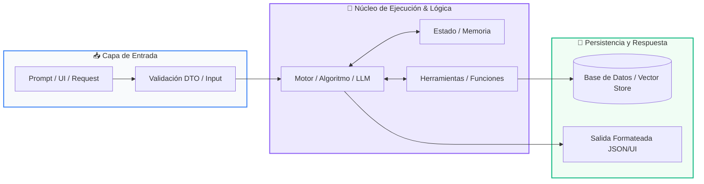

# 📖 Módulo 03: Recursividad y Programación Dinámica

> **Programa:** Curso 2: Algoritmos Avanzados y Estructuras de Datos (Nivel 2 (Intermedio))  
> **Nivel de Dificultad:** Intermedio  
> **Metáfora Central:** *«Las Muñecas Rusas (Matrioshkas) y la Libreta de Apuntes»*  
> **Python Version:** 3.10+ | **Licencia:** MIT  

---

## 👤 Acerca del Autor y Mentor

### **William Rodríguez (Wisrovi)**
**AI Solutions Architect & Principal Software Engineer** &bull; *Badajoz, España*

Ingeniero y arquitecto de software especializado en Inteligencia Artificial Generativa, sistemas multi-agente, Visión por Computador e infraestructuras MLOps de alta disponibilidad. Creador y mantenedor de la suite de software libre <strong>wisrovi SUITE</strong> en PyPI con más de 26 bibliotecas enfocadas en orquestación de pipelines, caching distribuido y optimización de bases de datos.

*   🐙 **GitHub:** [github.com/wisrovi](https://github.com/wisrovi)
*   💼 **LinkedIn:** [www.linkedin.com/in/wisrovi-rodriguez/](https://www.linkedin.com/in/wisrovi-rodriguez/)
*   🐳 **DockerHub:** [hub.docker.com/u/wisrovi](https://hub.docker.com/u/wisrovi)
*   🌐 **Website:** [wisrovi.dev](https://wisrovi.dev)
*   📦 **PyPI:** [pypi.org/user/wisrovi/](https://pypi.org/user/wisrovi/)

---

### 🚲 Metodología de Aprendizaje: La Regla de la Bicicleta

> *"Nadie aprende a montar en bicicleta viendo tutoriales. El verdadero dominio de la programación surge cuando abres tu editor, escribes código con tus propias manos, resuelves errores y construyes proyectos reales."*

> [!TIP]
> **El Compromiso Activo del Estudiante:** Abre Visual Studio Code en cada sesión. Escribe cada ejemplo con tus propias manos. Cambia los números, rompe el código deliberadamente para ver el mensaje de error de Python, y luego arréglalo.

---

## 📑 Tabla de Contenidos

| Capítulo | Tema | Enfoque Principal |
| :--- | :--- | :--- |
| **01** | **Fundamentos & Metáfora** | Pensamiento Recursivo y Subproblemas Superpuestos |
| **02** | **Arquitectura de Flujo** | Árbol de Llamadas Recursivas vs Tabla de Memoización |
| **03** | **Implementación Práctica** | Fibonacci Optimizado con Memoización |
| **04** | **Patrones & Debugging** | Gotchas en Recursividad |
| **05** | **Conclusiones & Cierre** | Resumen ejecutivo, notas del mentor y agradecimiento |
| **06** | **Bibliografía & Recursos** | Fuentes oficiales y retos de autoestudio |

### 🎯 Objetivos de Aprendizaje

*   **Competencia Conceptual:** Comprender la descomposición recursiva y cómo la memoización transforma complejidades exponenciales O(2^n) en lineales O(n).
*   **Competencia Práctica:** Implementar algoritmos recursivos seguros y optimizar cálculos pesados con decoradores nativos de Python.

---

## 1. 💡 Pensamiento Recursivo y Subproblemas Superpuestos

La recursividad ocurre cuando una función se invoca a sí misma para resolver una versión más pequeña del mismo problema.

> [!NOTE]
> ### 🌟 Metáfora Central: Las Muñecas Rusas (Matrioshkas) y la Libreta de Apuntes
> La recursión es como abrir una muñeca rusa (Matrioshka): abres una y hay otra idéntica más pequeña dentro, hasta llegar a la más diminuta que no se puede abrir (el Caso Base). La memoización es como tener una libreta de apuntes: cuando resuelves un cálculo difícil, anotas el resultado para no tener que volver a calcularlo jamás.

### Principios Teóricos y Modelo Mental

Todo algoritmo recursivo DEBE tener al menos un Caso Base para detener las llamadas antes de saturar el Call Stack (RecursionError).

Programación Dinámica (DP): Técnica para resolver problemas complejos descomponiéndolos en subproblemas y guardando sus soluciones.

> [!IMPORTANT]
> ### ⚡ Regla de Oro en Python
> Sin memoización, Fibonacci recursivo tiene complejidad O(2^n); con memoización se reduce a O(n).

---

## 2. 🗺️ Árbol de Llamadas Recursivas vs Tabla de Memoización

Eliminación de ramas redundantes en el árbol de ejecución mediante caché en memoria.

### Diagrama Visual del Flujo



### Desglose Paso a Paso del Flujo

| Fase del Flujo | Acción del Intérprete | Estado en Memoria |
| :--- | :--- | :--- |
| **1. Inicialización** | Llamada inicial a la función con el parámetro n. | `f(5) en Call Stack` |
| **2. Evaluación** | Bifurcación recursiva en f(n-1) y f(n-2). | `Subárbol de cálculos` |
| **3. Transformación** | Verificación en caché: si el resultado ya existe, lo devuelve inmediatamente sin recalcular. | `Hit en caché O(1)` |
| **4. Retorno / Salida** | Si no existe, computa el caso base y almacena el resultado antes de retornar. | `Guardado en memoria` |

> [!TIP]
> **Visualización Mental:** La memoización es intercambiar memoria (RAM) por tiempo de CPU: un compromiso altamente beneficioso en sistemas modernos.

---

## 3. 💻 Fibonacci Optimizado con Memoización

Comparativa entre recursión ingenua y optimización con el decorador lru_cache de la librería estándar:

```python
# main.py - Python 3.10+ PEP 8 Compliant
from functools import lru_cache
import time

# Versión Optimizada con Programación Dinámica
@lru_cache(maxsize=None)
def fibonacci_memo(n: int) -> int:
    if n <= 0: return 0
    if n == 1: return 1
    return fibonacci_memo(n - 1) + fibonacci_memo(n - 2)

# Cálculo instantáneo para n=100
inicio = time.perf_counter()
resultado = fibonacci_memo(100)
fin = time.perf_counter()

print(f"Fibonacci(100) = {resultado}")
print(f"Tiempo de cálculo: {(fin - inicio)*1000:.4f} ms")
```

### Análisis del Código Fuente

El decorador @lru_cache intercepta las llamadas y almacena los resultados en una tabla hash en memoria, logrando tiempo de ejecución instantáneo.

---

## 4. 🛡️ Gotchas en Recursividad

Errores críticos que pueden derribar servicios productivos:

> [!WARNING]
> ### ⚠️ Gotcha Frecuente (Trampa de Principiante)
> Olvidar el caso base o no avanzar hacia él en cada iteración, provocando un RecursionError por desbordamiento de pila.

### Comparativa: Antipatrón vs Patrón Recomendado

#### ❌ Antipatrón / Mal Código:
```python
def loop(n):
    return loop(n) # RecursionError: maximum recursion depth exceeded
```

#### ✅ Patrón Pythonic / Correcto:
```python
def loop(n):
    if n <= 0: return 0 # Caso base
    return n + loop(n - 1)
```

> [!TIP]
> **Consejo de Resiliencia en Producción:** Python tiene un límite de recursión por defecto de 1000 llamadas (sys.getrecursionlimit()).

---

## 5. 🏆 Conclusiones y Resumen Ejecutivo

Has dominado las técnicas de optimización más avanzadas de la ciencia de la computación aplicadas a Python.

> [!NOTE]
> ### 🎖️ Logro Alcanzado
> Capacidad para transformar problemas intratables en algoritmos de alto rendimiento con programación dinámica.

### 📝 Notas del Instructor
En el Curso 3 entraremos de lleno a la Inteligencia Artificial: LLMs, Prompt Engineering, RAG y Agentes Autónomos.

### 🤝 Mensaje de Agradecimiento
Muchas gracias por tu entusiasmo, disciplina y dedicación al participar en este programa formativo. La programación es un superpoder que transforma vidas cuando se ejerce con constancia y curiosidad. ¡Nos vemos en la próxima sesión para seguir construyendo juntos! 💻🚀

---

## 6. 📚 Bibliografía y Fuentes de Estudio

| Fuente / Recurso | Descripción Temática | Enlace Oficial |
| :--- | :--- | :--- |
| **Documentación Oficial de Python** | Referencia canónica del lenguaje y librería estándar | [docs.python.org/3/](https://docs.python.org/3/) |
| **PEP 8 — Style Guide for Python** | Guía oficial de estilo, formato e indentación | [peps.python.org/pep-0008/](https://peps.python.org/pep-0008/) |
| **Real Python Tutorials** | Artículos técnicos y patrones de desarrollo moderno | [realpython.com](https://realpython.com/) |
| **Python Type Checking (PEP 484)** | Anotaciones de tipo y análisis estático | [docs.python.org/typing](https://docs.python.org/3/library/typing.html) |
| **Suite Open Source wisrovi** | Paquetes Python para orquestación y rendimiento | [github.com/wisrovi](https://github.com/wisrovi) |

> [!TIP]
> ### 🏋️ Desafío de Autoestudio Recomendado
> Resuelve el clásico problema del cambio de monedas (Coin Change Problem) usando programación dinámica con tabulación.
