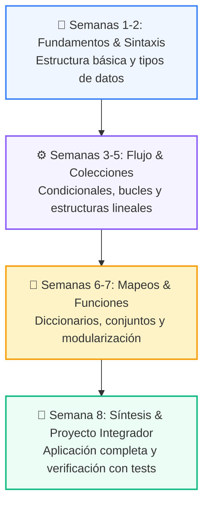

# 📚 Curso 2: Algoritmos Avanzados y Estructuras de Datos

> **Optimización de Memoria, Notación Big-O, Pilas, Colas, Búsqueda Binaria, Grafos y Programación Dinámica**  
> **Nivel:** Nivel 2 (Intermedio) &bull; **Duración:** 8 Semanas Formativas  
> **Instructor:** **William Rodríguez (Wisrovi)** (AI Solutions Architect & Principal Software Engineer)  

---

## 🗺️ Mapa de Ruta del Curso (8 Semanas)

---

## 📑 Clases del Curso

| Semana | Directorio | Contenido Temático | Metáfora Didáctica |
| :---: | :--- | :--- | :--- |
| **CLASE 01** | [`clase-01-analisis-complejidad-big-o/`](clase-01-analisis-complejidad-big-o/) | Análisis de Complejidad y Notación Big-O | *«Medir el Rendimiento de un Algoritmo a Medida que Crece la Entrada»* |
| **CLASE 02** | [`clase-02-pilas-y-colas/`](clase-02-pilas-y-colas/) | Pilas (Stacks) y Colas (Queues) con collections.deque | *«Pilas LIFO como Platos Apilados y Colas FIFO como la Fila del Supermercado»* |
| **CLASE 03** | [`clase-03-tablas-hash-y-sets/`](clase-03-tablas-hash-y-sets/) | Tablas Hash y Conjuntos (Sets) para Búsqueda O(1) | *«Tablas Hash como un Fichero con Índice Alfabético Instantáneo»* |
| **CLASE 04** | [`clase-04-algoritmos-busqueda/`](clase-04-algoritmos-busqueda/) | Lineal vs Binaria O(log n) | *«Búsqueda Binaria como Buscar una Palabra en el Diccionario Dividiendo a la Mitad»* |
| **CLASE 05** | [`clase-05-algoritmos-ordenamiento/`](clase-05-algoritmos-ordenamiento/) | QuickSort y MergeSort | *«Ordenar Barajas de Cartas con Divide y Vencerás»* |
| **CLASE 06** | [`clase-06-arboles-binarios-busqueda/`](clase-06-arboles-binarios-busqueda/) | Árboles Binarios de Búsqueda (BST) y Recorridos | *«Árboles como Organigramas Jerárquicos con Ramas Izquierda y Derecha»* |
| **CLASE 07** | [`clase-07-grafos-y-recorridos/`](clase-07-grafos-y-recorridos/) | Grafos, Matrices de Adyacencia y Recorridos BFS/DFS | *«Grafos como Redes de Ciudades y Rutas de Vuelo»* |
| **CLASE 08** | [`clase-08-recursividad-y-programacion-dinamica/`](clase-08-recursividad-y-programacion-dinamica/) | Recursividad y Programación Dinámica con Memoización | *«Programación Dinámica como Recordar el Pasado para no Resolverlo Dos Veces»* |

---

## 📦 Materiales Oficiales del Curso

*   📄 [`curso-02-algoritmos-estructuras.pdf`](curso-02-algoritmos-estructuras.pdf): Manual completo oficial en PDF compilado con estética LaTeX.
*   📖 [`book.md`](book.md): Libro de estudio digital con explicaciones profundas y diagramas Mermaid.
*   🧪 Suite de Pruebas Automatizadas en [`tests/curso_02/`](../tests/curso_02/).
