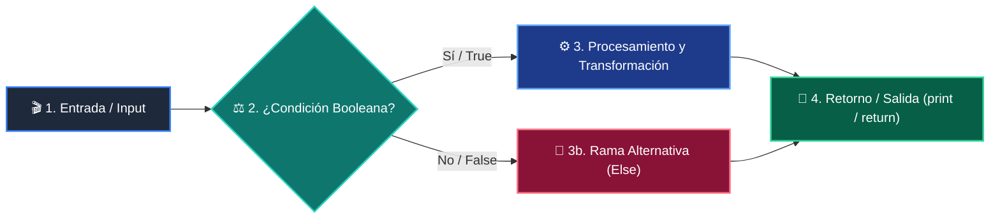

# 📚 Curso 2: Algoritmos Avanzados y Estructuras de Datos

> **Optimización de Memoria, Notación Big-O, Pilas, Colas, Búsqueda Binaria, Grafos y Programación Dinámica**  
> **Nivel:** Nivel 2 (Intermedio)  
> **Duración:** 8 Semanas (1 Clase por semana)  
> **Instructor:** **William Rodríguez (Wisrovi)** (AI Solutions Architect & Principal Software Engineer)  
> **Licencia:** MIT | **Python:** 3.10+  

---

## 📑 Hoja de Ruta y Tabla de Contenidos (8 Semanas)

| Semana / Clase | Título | Metáfora Central | Carpeta |
| :---: | :--- | :--- | :---: |
| **CLASE 01** | Clase 01: Análisis de Complejidad y Notación Big-O | *«Medir el Rendimiento de un Algoritmo a Medida que Crece la Entrada»* | [`clase-01-analisis-complejidad-big-o/`](clase-01-analisis-complejidad-big-o/) |
| **CLASE 02** | Clase 02: Pilas (Stacks) y Colas (Queues) con collections.deque | *«Pilas LIFO como Platos Apilados y Colas FIFO como la Fila del Supermercado»* | [`clase-02-pilas-y-colas/`](clase-02-pilas-y-colas/) |
| **CLASE 03** | Clase 03: Tablas Hash y Conjuntos (Sets) para Búsqueda O(1) | *«Tablas Hash como un Fichero con Índice Alfabético Instantáneo»* | [`clase-03-tablas-hash-y-sets/`](clase-03-tablas-hash-y-sets/) |
| **CLASE 04** | Clase 04: Algoritmos de Búsqueda: Lineal vs Binaria O(log n) | *«Búsqueda Binaria como Buscar una Palabra en el Diccionario Dividiendo a la Mitad»* | [`clase-04-algoritmos-busqueda/`](clase-04-algoritmos-busqueda/) |
| **CLASE 05** | Clase 05: Algoritmos de Ordenamiento: QuickSort y MergeSort | *«Ordenar Barajas de Cartas con Divide y Vencerás»* | [`clase-05-algoritmos-ordenamiento/`](clase-05-algoritmos-ordenamiento/) |
| **CLASE 06** | Clase 06: Árboles Binarios de Búsqueda (BST) y Recorridos | *«Árboles como Organigramas Jerárquicos con Ramas Izquierda y Derecha»* | [`clase-06-arboles-binarios-busqueda/`](clase-06-arboles-binarios-busqueda/) |
| **CLASE 07** | Clase 07: Grafos, Matrices de Adyacencia y Recorridos BFS/DFS | *«Grafos como Redes de Ciudades y Rutas de Vuelo»* | [`clase-07-grafos-y-recorridos/`](clase-07-grafos-y-recorridos/) |
| **CLASE 08** | Clase 08: Recursividad y Programación Dinámica con Memoización | *«Programación Dinámica como Recordar el Pasado para no Resolverlo Dos Veces»* | [`clase-08-recursividad-y-programacion-dinamica/`](clase-08-recursividad-y-programacion-dinamica/) |

---


# 📖 CLASE 01: Clase 01: Análisis de Complejidad y Notación Big-O

> **Metáfora:** *«Medir el Rendimiento de un Algoritmo a Medida que Crece la Entrada»*  
> **Objetivo:** Comprender la notación asintótica Big-O, análisis temporal y espacial en el peor caso.  

### 1. Fundamentos Teóricos
La notación Big-O describe cómo escala el tiempo de ejecución y el uso de memoria de un algoritmo.

> [!NOTE]
> **Metáfora Didáctica:** Big-O es como calcular cuánta gasolina consumirá un camión de carga según el número de kilómetros y peso.

Nos enfocamos en el peor caso (Worst-case scenario) y descartamos constantes y términos de menor orden.

> [!IMPORTANT]
> **Regla de Oro:** Evita los bucles anidados innecesarios para prevenir la degradación a O(n^2).

### 2. Diagrama de Arquitectura


### 3. Implementación en Python
```python
# CLASE 01
import time

def acceso_o1(lista: list, idx: int):
    return lista[idx]  # O(1)

def busqueda_on(lista: list, target: int):
    for item in lista:  # O(n)
        if item == target:
            return True
    return False

datos = list(range(1_000_000))
print("O(1) Acceso:", acceso_o1(datos, 500_000))
print("O(n) Búsqueda:", busqueda_on(datos, 999_999))
```

### 4. Gotchas y Buenas Prácticas
> [!WARNING]
> **Gotcha:** Usar 'if x in lista:' dentro de un bucle for convierte tu código silenciosamente en O(n^2).

*   **❌ Antipatrón:**
    ```python
for elem in lista_a:
    if elem in lista_b:  # ❌ 'in' en lista es O(n), total O(n^2)
        comunes.append(elem)
    ```
*   **✅ Patrón Correcto:**
    ```python
set_b = set(lista_b)  # O(n)
for elem in lista_a:
    if elem in set_b:    # ✅ 'in' en set es O(1), total O(n)
        comunes.append(elem)
    ```

---

# 📖 CLASE 02: Clase 02: Pilas (Stacks) y Colas (Queues) con collections.deque

> **Metáfora:** *«Pilas LIFO como Platos Apilados y Colas FIFO como la Fila del Supermercado»*  
> **Objetivo:** Comprender los principios LIFO (Last In, First Out) y FIFO (First In, First Out).  

### 1. Fundamentos Teóricos
Las pilas y colas son estructuras de datos lineales que restringen la inserción y extracción según una disciplina estricta.

> [!NOTE]
> **Metáfora Didáctica:** Una pila es como una torre de platos (el último que pones es el primero que lavas); una cola es la fila del banco (el primero en llegar es el primero en ser atendido).

Una lista de Python como cola es ineficiente: lista.pop(0) es O(n) porque desplaza todos los elementos en memoria.

> [!IMPORTANT]
> **Regla de Oro:** Nunca uses lista.pop(0) para colas; usa siempre collections.deque().popleft().

### 2. Diagrama de Arquitectura


### 3. Implementación en Python
```python
# CLASE 02
from collections import deque

# 1. Pila (Stack LIFO)
def balanceado(expr: str) -> bool:
    pila = []
    mapa = {")": "(", "}": "{", "]": "["}
    for char in expr:
        if char in mapa.values(): pila.append(char)
        elif char in mapa:
            if not pila or pila.pop() != mapa[char]: return False
    return len(pila) == 0

# 2. Cola (Queue FIFO)
cola = deque(["Ticket 1", "Ticket 2", "Ticket 3"])
cola.append("Ticket 4")
print("Atendido:", cola.popleft())  # Ticket 1
print("Es valido:", balanceado("{[()]}"))
```

### 4. Gotchas y Buenas Prácticas
> [!WARNING]
> **Gotcha:** Usar list.pop(0) en colas con miles de elementos colapsa el rendimiento de la CPU.

*   **❌ Antipatrón:**
    ```python
cola = []
cola.append(x)
primero = cola.pop(0)  # ❌ O(n) movimiento de bloques en memoria
    ```
*   **✅ Patrón Correcto:**
    ```python
from collections import deque
cola = deque()
cola.append(x)
primero = cola.popleft()  # ✅ O(1) instantáneo
    ```

---

# 📖 CLASE 03: Clase 03: Tablas Hash y Conjuntos (Sets) para Búsqueda O(1)

> **Metáfora:** *«Tablas Hash como un Fichero con Índice Alfabético Instantáneo»*  
> **Objetivo:** Comprender la función hash, manejo de colisiones y costo amortizado O(1).  

### 1. Fundamentos Teóricos
Las tablas hash convierten una clave arbitraria en un índice numérico mediante una función matemática de hashing.

> [!NOTE]
> **Metáfora Didáctica:** Es como un conserje de hotel que sabe instantáneamente el casillero de cada huésped con solo mirar su apellido.

Las colisiones ocurren cuando dos claves distintas generan el mismo hash; CPython usa open addressing con perturbación.

> [!IMPORTANT]
> **Regla de Oro:** Cualquier objeto que uses como clave de diccionario o elemento de set debe implementar __hash__ e inmutabilidad.

### 2. Diagrama de Arquitectura


### 3. Implementación en Python
```python
# CLASE 03
def two_sum(nums: list[int], target: int) -> tuple[int, int]:
    vistos = {}  # mapa: valor -> indice
    for i, num in enumerate(nums):
        complemento = target - num
        if complemento in vistos:
            return (vistos[complemento], i)
        vistos[num] = i
    return (-1, -1)

indices = two_sum([2, 7, 11, 15], 9)
print("Índices que suman 9:", indices)  # (0, 1)
```

### 4. Gotchas y Buenas Prácticas
> [!WARNING]
> **Gotcha:** Intentar usar una lista mutable como clave de diccionario o elemento de set genera TypeError: unhashable type.

*   **❌ Antipatrón:**
    ```python
mi_dict = {}
mi_dict[[1, 2]] = 'valor'  # ❌ TypeError: unhashable type: 'list'
    ```
*   **✅ Patrón Correcto:**
    ```python
mi_dict = {}
mi_dict[(1, 2)] = 'valor'  # ✅ Tupla inmutable hashable
    ```

---

# 📖 CLASE 04: Clase 04: Algoritmos de Búsqueda: Lineal vs Binaria O(log n)

> **Metáfora:** *«Búsqueda Binaria como Buscar una Palabra en el Diccionario Dividiendo a la Mitad»*  
> **Objetivo:** Comprender la técnica 'Divide y Vencerás' y la reducción logarítmica del espacio de búsqueda.  

### 1. Fundamentos Teóricos
Buscar elementos en grandes volúmenes de datos requiere algoritmos más inteligentes que la simple inspección secuencial.

> [!NOTE]
> **Metáfora Didáctica:** Para encontrar la página 500 de un libro de 1000 páginas, lo abres a la mitad exacta y descartas 500 páginas de golpe.

Búsqueda Lineal O(n): Inspecciona uno a uno. Funciona en listas desordenadas.

> [!IMPORTANT]
> **Regla de Oro:** La búsqueda binaria solo es válida sobre arreglos previamente ordenados.

### 2. Diagrama de Arquitectura


### 3. Implementación en Python
```python
# CLASE 04
import bisect

def busqueda_binaria(arr: list[int], target: int) -> int:
    left, right = 0, len(arr) - 1
    while left <= right:
        mid = (left + right) // 2
        if arr[mid] == target:
            return mid
        elif arr[mid] < target:
            left = mid + 1
        else:
            right = mid - 1
    return -1

datos = [10, 20, 30, 40, 50, 60, 70, 80]
idx = busqueda_binaria(datos, 60)
print("Índice de 60:", idx)  # 5
print("Índice con bisect_left:", bisect.bisect_left(datos, 60))
```

### 4. Gotchas y Buenas Prácticas
> [!WARNING]
> **Gotcha:** Escribir while left < right en lugar de left <= right omite evaluar el último elemento restante.

*   **❌ Antipatrón:**
    ```python
while left < right:  # ❌ Puede fallar si el target está en el último elemento
    ```
*   **✅ Patrón Correcto:**
    ```python
while left <= right:  # ✅ Evalúa todos los casos correctamente
    ```

---

# 📖 CLASE 05: Clase 05: Algoritmos de Ordenamiento: QuickSort y MergeSort

> **Metáfora:** *«Ordenar Barajas de Cartas con Divide y Vencerás»*  
> **Objetivo:** Comprender la estabilidad, complejidad O(n log n) y particionamiento por pivote.  

### 1. Fundamentos Teóricos
El ordenamiento es la base de la optimización en ciencias de la computación.

> [!NOTE]
> **Metáfora Didáctica:** QuickSort elige un elemento pivote y separa las cartas en dos montones: menores a la izquierda, mayores a la derecha.

Algoritmos cuadráticos O(n^2) como Bubble o Insertion Sort son lentos para grandes volúmenes.

> [!IMPORTANT]
> **Regla de Oro:** En producción, usa siempre el método .sort() de Python, que implementa Timsort (híbrido optimizado en C).

### 2. Diagrama de Arquitectura


### 3. Implementación en Python
```python
# CLASE 05
def quicksort(arr: list[int]) -> list[int]:
    if len(arr) <= 1:
        return arr
    pivote = arr[len(arr) // 2]
    menores = [x for x in arr if x < pivote]
    iguales = [x for x in arr if x == pivote]
    mayores = [x for x in arr if x > pivote]
    return quicksort(menores) + iguales + quicksort(mayores)

desordenados = [38, 27, 43, 3, 9, 82, 10]
print("Ordenados:", quicksort(desordenados))
```

### 4. Gotchas y Buenas Prácticas
> [!WARNING]
> **Gotcha:** Elegir siempre el primer elemento como pivote en una lista que ya está ordenada genera O(n^2).

*   **❌ Antipatrón:**
    ```python
pivote = arr[0]  # ❌ Degrada a O(n^2) si la lista ya viene ordenada
    ```
*   **✅ Patrón Correcto:**
    ```python
pivote = arr[len(arr) // 2]  # ✅ Pivote central o aleatorio
    ```

---

# 📖 CLASE 06: Clase 06: Árboles Binarios de Búsqueda (BST) y Recorridos

> **Metáfora:** *«Árboles como Organigramas Jerárquicos con Ramas Izquierda y Derecha»*  
> **Objetivo:** Comprender la estructura de nodos, punteros, propiedad BST y recorridos in-order, pre-order y post-order.  

### 1. Fundamentos Teóricos
Los árboles binarios organizan la información de manera jerárquica para permitir búsquedas e inserciones rápidas.

> [!NOTE]
> **Metáfora Didáctica:** Un árbol BST es como un árbol genealógico donde a la izquierda van los números menores y a la derecha los mayores.

Propiedad BST: Para cada nodo, todo valor en su subárbol izquierdo es menor, y en su subárbol derecho es mayor.

> [!IMPORTANT]
> **Regla de Oro:** Un árbol desbalanceado degenera en una lista enlazada O(n); los árboles balanceados mantienen O(log n).

### 2. Diagrama de Arquitectura


### 3. Implementación en Python
```python
# CLASE 06
class Nodo:
    def __init__(self, val: int):
        self.val = val
        self.izq = None
        self.der = None

def insertar(raiz: Nodo, val: int) -> Nodo:
    if not raiz: return Nodo(val)
    if val < raiz.val: raiz.izq = insertar(raiz.izq, val)
    else: raiz.der = insertar(raiz.der, val)
    return raiz

def in_order(raiz: Nodo, res: list):
    if raiz:
        in_order(raiz.izq, res)
        res.append(raiz.val)
        in_order(raiz.der, res)

raiz = None
for num in [50, 30, 70, 20, 40, 60, 80]:
    raiz = insertar(raiz, num)

elementos = []
in_order(raiz, elementos)
print("Recorrido In-Order:", elementos)
```

### 4. Gotchas y Buenas Prácticas
> [!WARNING]
> **Gotcha:** Olvidar validar if not nodo antes de acceder a nodo.izq produce AttributeError: 'NoneType' object has no attribute.

*   **❌ Antipatrón:**
    ```python
def buscar(nodo, val):
    if nodo.val == val: return True  # ❌ Falla si nodo es None
    ```
*   **✅ Patrón Correcto:**
    ```python
def buscar(nodo, val):
    if not nodo: return False       # ✅ Caso base de seguridad
    if nodo.val == val: return True
    ```

---

# 📖 CLASE 07: Clase 07: Grafos, Matrices de Adyacencia y Recorridos BFS/DFS

> **Metáfora:** *«Grafos como Redes de Ciudades y Rutas de Vuelo»*  
> **Objetivo:** Comprender vértices, aristas, listas de adyacencia y algoritmos de búsqueda en grafos.  

### 1. Fundamentos Teóricos
Los grafos modelan relaciones complejas de red entre entidades (redes sociales, mapas, dependencias).

> [!NOTE]
> **Metáfora Didáctica:** Un grafo es un mapa de aeropuertos (nodos) conectados por vuelos (aristas).

BFS (Breadth-First Search) explora por capas concéntricas usando una Cola FIFO; encuentra el camino más corto.

> [!IMPORTANT]
> **Regla de Oro:** En grafos con ciclos, mantén siempre un conjunto 'visitados = set()' para evitar bucles infinitos.

### 2. Diagrama de Arquitectura


### 3. Implementación en Python
```python
# CLASE 07
from collections import deque

grafo = {
    "A": ["B", "C"],
    "B": ["A", "D", "E"],
    "C": ["A", "F"],
    "D": ["B"],
    "E": ["B", "F"],
    "F": ["C", "E"]
}

def bfs(grafo: dict, inicio: str) -> list[str]:
    visitados = {inicio}
    cola = deque([inicio])
    recorrido = []
    while cola:
        nodo = cola.popleft()
        recorrido.append(nodo)
        for vecino in grafo.get(nodo, []):
            if vecino not in visitados:
                visitados.add(vecino)
                cola.append(vecino)
    return recorrido

print("Recorrido BFS:", bfs(grafo, "A"))
```

### 4. Gotchas y Buenas Prácticas
> [!WARNING]
> **Gotcha:** No registrar los nodos en visitados provoca un RecursionError o bucle infinito.

*   **❌ Antipatrón:**
    ```python
def dfs(nodo):
    for v in grafo[nodo]: dfs(v)  # ❌ Sin control de visitados en grafo cíclico
    ```
*   **✅ Patrón Correcto:**
    ```python
def dfs(nodo, visitados=None):
    if visitados is None: visitados = set()
    visitados.add(nodo)
    for v in grafo[nodo]:
        if v not in visitados: dfs(v, visitados)  # ✅ Seguro
    ```

---

# 📖 CLASE 08: Clase 08: Recursividad y Programación Dinámica con Memoización

> **Metáfora:** *«Programación Dinámica como Recordar el Pasado para no Resolverlo Dos Veces»*  
> **Objetivo:** Comprender subproblemas superpuestos, subestructura óptima y memoización con functools.lru_cache.  

### 1. Fundamentos Teóricos
La programación dinámica es una técnica de optimización que almacena los resultados de subproblemas ya resueltos.

> [!NOTE]
> **Metáfora Didáctica:** Si te pregunto cuánto es 1+1+1+1, cuentas 4. Si añado otro +1, sabes que es 5 porque recordaste el 4 anterior.

Recursión simple (Naive): Resuelve los mismos subproblemas miles de veces (explosión exponencial O(2^n)).

> [!IMPORTANT]
> **Regla de Oro:** En Python, decora tus funciones recursivas puras con @functools.lru_cache(maxsize=None).

### 2. Diagrama de Arquitectura


### 3. Implementación en Python
```python
# CLASE 08
from functools import lru_cache
import time

@lru_cache(maxsize=None)
def fibonacci(n: int) -> int:
    if n <= 1:
        return n
    return fibonacci(n - 1) + fibonacci(n - 2)

t0 = time.perf_counter()
res = fibonacci(50)
t1 = time.perf_counter()

print(f"Fibonacci(50) = {res}")
print(f"Calculado en: {(t1 - t0)*1000:.4f} ms (Tiempo O(n))")
```

### 4. Gotchas y Buenas Prácticas
> [!WARNING]
> **Gotcha:** Recursiones muy profundas superan el límite de la pila de llamadas (por defecto 1000).

*   **❌ Antipatrón:**
    ```python
def contar(n):
    if n == 0: return 0
    return contar(n - 1)  # ❌ Falla con n > 1000 por RecursionError
    ```
*   **✅ Patrón Correcto:**
    ```python
# Enfoque iterativo (Bottom-Up) o sys.setrecursionlimit
def contar_iterativo(n):
    return sum(range(n))  # ✅ O(1) memoria
    ```

---
