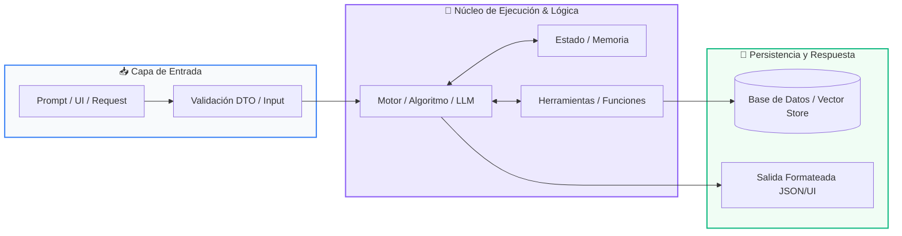
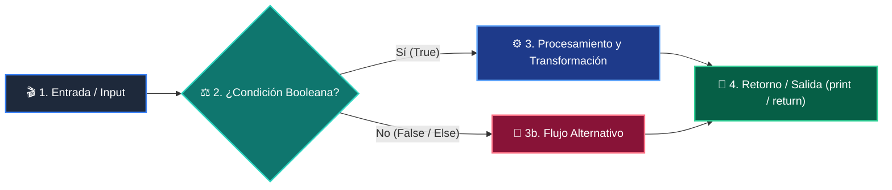

# 📚 Curso 2: Algoritmos Avanzados y Estructuras de Datos

> **Nivel:** Nivel 2 (Intermedio)  
> **Enfoque:** Optimización de Memoria, Notación Big-O, Pilas, Colas, Búsqueda Binaria y Programación Dinámica  
> **Python Version:** 3.10+ | **Licencia:** MIT  
> **Instructor:** **William Rodríguez (Wisrovi)** (AI Solutions Architect & Principal Software Engineer)  

---

## 👤 Perfil del Instructor y Mentor

### **William Rodríguez (Wisrovi)**
*AI Solutions Architect & Principal Software Engineer &bull; Badajoz, España*

Ingeniero y arquitecto de software especializado en Inteligencia Artificial Generativa, sistemas multi-agente, Visión por Computador e infraestructuras MLOps de alta disponibilidad. Creador y mantenedor de la suite de software libre <strong>wisrovi SUITE</strong> en PyPI con más de 26 bibliotecas enfocadas en orquestación de pipelines, caching distribuido y optimización de bases de datos.

*   🐙 **GitHub:** [github.com/wisrovi](https://github.com/wisrovi)
*   💼 **LinkedIn:** [www.linkedin.com/in/wisrovi-rodriguez/](https://www.linkedin.com/in/wisrovi-rodriguez/)
*   🐳 **DockerHub:** [hub.docker.com/u/wisrovi](https://hub.docker.com/u/wisrovi)
*   🌐 **Website:** [wisrovi.dev](https://wisrovi.dev)
*   📦 **PyPI:** [pypi.org/user/wisrovi/](https://pypi.org/user/wisrovi/)

---

### 🚲 Filosofía de Aprendizaje: La Regla de la Bicicleta

> *"Nadie aprende a montar en bicicleta viendo tutoriales. El verdadero dominio de la programación surge cuando abres tu editor, escribes código con tus propias manos, resuelves errores y construyes proyectos reales."*

---

## 📑 Hoja de Ruta y Tabla de Contenidos del Curso

| Módulo / Clase | Título Temático | Metáfora Central | Enlace a Carpeta |
| :---: | :--- | :--- | :---: |
| **Módulo 01** | Módulo 01: Estructuras de Datos Avanzadas | *Pilas LIFO, Colas FIFO y Árboles Jerárquicos* | [`01-estructuras-datos-avanzadas/`](01-estructuras-datos-avanzadas/) |
| **Módulo 02** | Módulo 02: Ordenamiento, Búsqueda y Big-O | *El Diccionario por la Mitad y Divide y Vencerás* | [`02-algoritmos-ordenamiento-busqueda/`](02-algoritmos-ordenamiento-busqueda/) |
| **Módulo 03** | Módulo 03: Recursividad y Programación Dinámica | *Las Muñecas Rusas (Matrioshkas) y la Libreta de Apuntes* | [`03-recursividad-optimizacion/`](03-recursividad-optimizacion/) |

---


# 📖 Módulo 01: Módulo 01: Estructuras de Datos Avanzadas

> **Metáfora:** *«Pilas LIFO, Colas FIFO y Árboles Jerárquicos»*  
> **Objetivo:** Comprender las disciplinas de acceso LIFO y FIFO y el coste temporal O(1) vs O(n) en memoria.  

### 1. Fundamentación y Modelo Mental

Las listas básicas no siempre son la estructura óptima cuando la velocidad de inserción y extracción en los extremos es crítica.

> [!NOTE]
> **Metáfora Didáctica:** Una Pila (Stack) es como una pila de platos: el último que colocas arriba es el primero que lavas (LIFO: Last In, First Out). Una Cola (Queue) es como la fila del supermercado: el primero que llega es el primero en ser atendido (FIFO: First In, First Out).

collections.deque en Python permite inserciones y extracciones O(1) tanto por la izquierda como por la derecha, a diferencia de list.pop(0) que cuesta O(n).

Los conjuntos (sets) implementan álgebra de conjuntos (unión, intersección, diferencia) con consultas O(1) y garantizan elementos únicos.

> [!IMPORTANT]
> **Regla de Oro:** Para colas FIFO de alto rendimiento en Python, utiliza siempre collections.deque en lugar de listas estándar.

### 2. Arquitectura de Flujo



| Fase | Acción del Intérprete | Estado en Memoria |
| :--- | :--- | :--- |
| **Inicialización** | Operación Push / Enqueue: Ingreso de nuevo elemento. | `Elemento en memoria` |
| **Evaluación** | En Stack (LIFO): Se coloca en el tope y se extrae del tope. | `Último en entrar = Primero en salir` |
| **Transformación** | En Queue (FIFO): Se ingresa por la cola y se extrae por la cabeza. | `Primero en entrar = Primero en salir` |
| **Salida / Retorno** | Árboles: Ramifican decisiones jerárquicas izquierda/derecha. | `Acceso logarítmico O(log n)` |

### 3. Implementación en Python

```python
# Módulo 01 - main.py
def validar_parentesis(expresion: str) -> bool:
    pila: list[str] = []
    pares = {")": "(", "}": "{", "]": "["}
    
    for char in expresion:
        if char in pares.values():
            pila.append(char) # Push
        elif char in pares:
            if not pila or pila.pop() != pares[char]: # Pop & Check
                return False
                
    return len(pila) == 0

# Pruebas
print(validar_parentesis("{[()()]}"))  # True
print(validar_parentesis("{[(])}"))    # False
```

*El algoritmo apila los caracteres de apertura y los desapila al encontrar cierres, garantizando correspondencia simétrica en O(n).*

### 4. Gotchas Comunes y Buenas Prácticas

> [!WARNING]
> **Trampa de Principiante:** Usar list.pop(0) para implementar una cola; obliga a desplazar todos los elementos restantes en memoria generando complejidad O(n).

*   **❌ Antipatrón:**
    ```python
    cola = []
cola.insert(0, item) # O(n) en cada inserción
    ```
*   **✅ Patrón Correcto:**
    ```python
    from collections import deque
cola = deque()
cola.append(item) # O(1) instantáneo
    ```

> [!TIP]
> **Consejo Profesional:** Usa sets para eliminar duplicados de una lista en una sola operación: unicos = list(set(datos)).

---


# 📖 Módulo 02: Módulo 02: Ordenamiento, Búsqueda y Big-O

> **Metáfora:** *«El Diccionario por la Mitad y Divide y Vencerás»*  
> **Objetivo:** Comprender cómo escala el tiempo de ejecución a medida que el tamaño de entrada (n) crece hacia el infinito.  

### 1. Fundamentación y Modelo Mental

En software la velocidad no se mide en segundos, sino en cómo crece el número de operaciones en función del volumen de datos (n).

> [!NOTE]
> **Metáfora Didáctica:** Si buscas una palabra en un diccionario de 1,000 páginas hojeando página por página (búsqueda lineal), puedes tardar 1,000 pasos. Si abres el diccionario por la mitad exacta y descartas la mitad irrelevante (búsqueda binaria), encontrarás la palabra en solo 10 pasos.

Escalas de Complejidad: O(1) Constante < O(log n) Logarítmica < O(n) Lineal < O(n log n) Casi-lineal < O(n^2) Cuadrática.

Búsqueda Binaria requiere que la colección esté previamente ordenada para garantizar reducción del espacio de búsqueda a la mitad.

> [!IMPORTANT]
> **Regla de Oro:** Evita los bucles anidados innecesarios: dos bucles anidados sobre n elementos convierten un algoritmo de O(n) a O(n^2).

### 2. Arquitectura de Flujo



| Fase | Acción del Intérprete | Estado en Memoria |
| :--- | :--- | :--- |
| **Inicialización** | Calcula el punto medio: mid = (low + high) // 2. | `low=0, high=n-1, mid` |
| **Evaluación** | Compara el elemento en 'mid' con el objetivo buscado. | `Evalúa igualdad` |
| **Transformación** | Si objetivo < array[mid], descarta la mitad derecha ajustando high = mid - 1. | `Espacio reducido al 50%` |
| **Salida / Retorno** | Si objetivo > array[mid], descarta la mitad izquierda ajustando low = mid + 1. | `Repite hasta converger` |

### 3. Implementación en Python

```python
# Módulo 02 - main.py
def busqueda_binaria(lista: list[int], objetivo: int) -> int:
    low, high = 0, len(lista) - 1
    while low <= high:
        mid = (low + high) // 2
        if lista[mid] == objetivo:
            return mid # Encontrado
        elif lista[mid] < objetivo:
            low = mid + 1
        else:
            high = mid - 1
    return -1 # No existe

def quicksort(arr: list[int]) -> list[int]:
    if len(arr) <= 1:
        return arr
    pivote = arr[len(arr) // 2]
    izq = [x for x in arr if x < pivote]
    centro = [x for x in arr if x == pivote]
    der = [x for x in arr if x > pivote]
    return quicksort(izq) + centro + quicksort(der)
```

*Búsqueda Binaria O(log n) combinada con QuickSort O(n log n) basado en listas por comprensión.*

### 4. Gotchas Comunes y Buenas Prácticas

> [!WARNING]
> **Trampa de Principiante:** Ejecutar búsqueda binaria sobre una lista no ordenada; produce falsos negativos y resultados erráticos.

*   **❌ Antipatrón:**
    ```python
    desordenada = [9, 1, 5, 2]
busqueda_binaria(desordenada, 5) # ¡Falla!
    ```
*   **✅ Patrón Correcto:**
    ```python
    ordenada = sorted(desordenada)
busqueda_binaria(ordenada, 5) # Retorna índice correcto
    ```

> [!TIP]
> **Consejo Profesional:** Python utiliza Timsort (híbrido de MergeSort e InsertionSort) en lista.sort(), el cual tiene complejidad garantizada O(n log n).

---


# 📖 Módulo 03: Módulo 03: Recursividad y Programación Dinámica

> **Metáfora:** *«Las Muñecas Rusas (Matrioshkas) y la Libreta de Apuntes»*  
> **Objetivo:** Comprender la descomposición recursiva y cómo la memoización transforma complejidades exponenciales O(2^n) en lineales O(n).  

### 1. Fundamentación y Modelo Mental

La recursividad ocurre cuando una función se invoca a sí misma para resolver una versión más pequeña del mismo problema.

> [!NOTE]
> **Metáfora Didáctica:** La recursión es como abrir una muñeca rusa (Matrioshka): abres una y hay otra idéntica más pequeña dentro, hasta llegar a la más diminuta que no se puede abrir (el Caso Base). La memoización es como tener una libreta de apuntes: cuando resuelves un cálculo difícil, anotas el resultado para no tener que volver a calcularlo jamás.

Todo algoritmo recursivo DEBE tener al menos un Caso Base para detener las llamadas antes de saturar el Call Stack (RecursionError).

Programación Dinámica (DP): Técnica para resolver problemas complejos descomponiéndolos en subproblemas y guardando sus soluciones.

> [!IMPORTANT]
> **Regla de Oro:** Sin memoización, Fibonacci recursivo tiene complejidad O(2^n); con memoización se reduce a O(n).

### 2. Arquitectura de Flujo


| Fase | Acción del Intérprete | Estado en Memoria |
| :--- | :--- | :--- |
| **Inicialización** | Llamada inicial a la función con el parámetro n. | `f(5) en Call Stack` |
| **Evaluación** | Bifurcación recursiva en f(n-1) y f(n-2). | `Subárbol de cálculos` |
| **Transformación** | Verificación en caché: si el resultado ya existe, lo devuelve inmediatamente sin recalcular. | `Hit en caché O(1)` |
| **Salida / Retorno** | Si no existe, computa el caso base y almacena el resultado antes de retornar. | `Guardado en memoria` |

### 3. Implementación en Python

```python
# Módulo 03 - main.py
from functools import lru_cache
import time

# Versión Optimizada con Programación Dinámica
@lru_cache(maxsize=None)
def fibonacci_memo(n: int) -> int:
    if n <= 0: return 0
    if n == 1: return 1
    return fibonacci_memo(n - 1) + fibonacci_memo(n - 2)

# Cálculo instantáneo para n=100
inicio = time.perf_counter()
resultado = fibonacci_memo(100)
fin = time.perf_counter()

print(f"Fibonacci(100) = {resultado}")
print(f"Tiempo de cálculo: {(fin - inicio)*1000:.4f} ms")
```

*El decorador @lru_cache intercepta las llamadas y almacena los resultados en una tabla hash en memoria, logrando tiempo de ejecución instantáneo.*

### 4. Gotchas Comunes y Buenas Prácticas

> [!WARNING]
> **Trampa de Principiante:** Olvidar el caso base o no avanzar hacia él en cada iteración, provocando un RecursionError por desbordamiento de pila.

*   **❌ Antipatrón:**
    ```python
    def loop(n):
    return loop(n) # RecursionError: maximum recursion depth exceeded
    ```
*   **✅ Patrón Correcto:**
    ```python
    def loop(n):
    if n <= 0: return 0 # Caso base
    return n + loop(n - 1)
    ```

> [!TIP]
> **Consejo Profesional:** Python tiene un límite de recursión por defecto de 1000 llamadas (sys.getrecursionlimit()).

---


## 🏆 Conclusiones Generales de Curso 2: Algoritmos Avanzados y Estructuras de Datos

Has completado el manual de referencia completo para este nivel. Continúa profundizando y aplicando estos conceptos en proyectos reales.

### 📚 Bibliografía Oficial y Enlaces Recomendados

| Recurso | Enfoque | Enlace |
| :--- | :--- | :--- |
| **Documentación Oficial de Python** | Referencia canónica del lenguaje | [docs.python.org/3/](https://docs.python.org/3/) |
| **PEP 8 — Style Guide for Python** | Estándar de formato y estilo | [peps.python.org/pep-0008/](https://peps.python.org/pep-0008/) |
| **Real Python Tutorials** | Artículos técnicos y buenas prácticas | [realpython.com](https://realpython.com/) |
| **Suite Open Source wisrovi** | Librerías de alto rendimiento | [github.com/wisrovi](https://github.com/wisrovi) |
