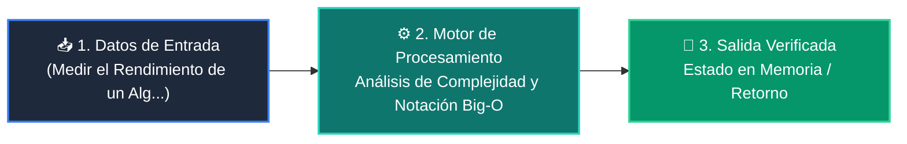

# 📘 Clase 01: Análisis de Complejidad y Notación Big-O

<div align="center">

**Curso 2: Algoritmos Avanzados y Estructuras de Datos** &bull; **Semana CLASE 01**  
*Nivel:* `Nivel 2 - Intermedio` &bull; *Metáfora Central:* **«Medir el Rendimiento de un Algoritmo a Medida que Crece la Entrada»**

[](https://colab.research.google.com/github/wisrovi/wisrovi-python/blob/main/02-algoritmos-estructuras/clase-01-analisis-complejidad-big-o/notebook/clase-01-analisis-complejidad-big-o.ipynb)
[](clase-01-analisis-complejidad-big-o.pdf)
[](book.md)

</div>

---

## 🎯 Objetivos de Aprendizaje de la Sesión

*   **Competencia Conceptual:** Comprender el modelo mental de *«Medir el Rendimiento de un Algoritmo a Medida que Crece la Entrada»* (Big-O es como calcular cuánta gasolina consumirá un camión de carga según el número de kilómetros y peso.).
*   **Competencia Práctica:** Escribir, ejecutar y depurar scripts en Python aplicando buenas prácticas (PEP 8) y tipado.
*   **Competencia de Ingeniería:** Resolver el reto práctico de la sesión y verificar su correcto funcionamiento con la suite de pruebas automatizadas.

---

## 🗺️ Mapa de Arquitectura y Flujo de Ejecución



---

## 📂 Organización de Materiales en esta Clase

```text
clase-01-analisis-complejidad-big-o/
├── 📄 clase-01-analisis-complejidad-big-o.pdf       # Manual técnico oficial de estudio (9 páginas)
├── 📖 book.md                     # Libro digital interactivo con diagramas Mermaid
├── 📝 README.md                   # Esta guía general de la clase
├── 📁 notebook/                   # Cuaderno Jupyter interactivo
│   ├── 📓 clase-01-analisis-complejidad-big-o.ipynb
│   └── 📝 README.md               # Guía con badge a Google Colab
├── 📁 ejemplos/                   # Carpetas de código estructurado paso a paso
│   └── 📝 README.md               # Catálogo de ejemplos con comandos de ejecución
└── 📁 ejercicios/                 # Reto práctico para el estudiante
    ├── 🐍 reto.py                 # Enunciado y plantilla del ejercicio
    └── 📝 README.md               # Instrucciones de resolución y comandos pytest
```

---

## 🏋️ Desafío Práctico de la Sesión
> **Enunciado:** Escribe un script que compare el tiempo real de buscar un elemento en una lista vs un set de 500.000 elementos.

Abre el archivo [`ejercicios/reto.py`](ejercicios/reto.py), completa tu implementación y valida tu código ejecutando:
```bash
pytest tests/curso_02/test_clase_01_analisis_complejidad_big_o.py
```
