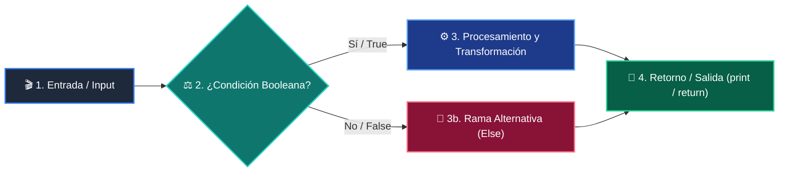

# 📚 Clase 01: Análisis de Complejidad y Notación Big-O

> **Programa:** Curso 2: Algoritmos Avanzados y Estructuras de Datos  
> **Nivel:** Nivel 2 - Intermedio  
> **Metáfora Central:** *«Medir el Rendimiento de un Algoritmo a Medida que Crece la Entrada»*  
> **Documento Oficial PDF:** [clase-01-analisis-complejidad-big-o.pdf](clase-01-analisis-complejidad-big-o.pdf)  
> **Instructor:** **William Rodríguez (Wisrovi)** (AI Solutions Architect & Principal Software Engineer)  

---

## 👤 Perfil del Autor y Mentor

### **William Rodríguez (Wisrovi)**
*AI Solutions Architect & Principal Software Engineer &bull; Badajoz, España*

Ingeniero y arquitecto de software especializado en Inteligencia Artificial Generativa, sistemas multi-agente, Visión por Computador e infraestructuras MLOps de alta disponibilidad. Creador y mantenedor de la suite de software libre wisrovi SUITE en PyPI con más de 26 bibliotecas enfocadas en orquestación de pipelines, caching distribuido y optimización de bases de datos.

*   🐙 **GitHub:** [github.com/wisrovi](https://github.com/wisrovi)
*   💼 **LinkedIn:** [www.linkedin.com/in/wisrovi-rodriguez/](https://www.linkedin.com/in/wisrovi-rodriguez/)
*   🐳 **DockerHub:** [hub.docker.com/u/wisrovi](https://hub.docker.com/u/wisrovi)
*   🌐 **Website:** [wisrovi.dev](https://wisrovi.dev)
*   📦 **PyPI:** [pypi.org/user/wisrovi/](https://pypi.org/user/wisrovi/)

---

### 🚲 La Regla de la Bicicleta

> *"Nadie aprende a montar en bicicleta viendo tutoriales. El verdadero dominio de la programación surge cuando abres tu editor, escribes código con tus propias manos, resuelves errores y construyes proyectos reales."*

---

## 📑 Tabla de Contenidos de la Sesión

1. [💡 Fundamentación Teórica y Modelo Mental](#1--fundamentación-teórica-y-modelo-mental)
2. [🗺️ Arquitectura y Diagrama de Flujo](#2-️-arquitectura-y-diagrama-de-flujo)
3. [💻 Implementación en Python 3.10+](#3--implementación-en-python-310)
4. [🛡️ Buenas Prácticas y Trampas Frecuentes](#4-️-buenas-prácticas-y-trampas-frecuentes)
5. [🏋️ Desafío de Práctica](#5-️-desafío-de-práctica)
6. [📚 Bibliografía y Enlaces Canónicos](#6--bibliografía-y-enlaces-canónicos)

---

## 1. 💡 Fundamentación Teórica y Modelo Mental

La notación Big-O describe cómo escala el tiempo de ejecución y el uso de memoria de un algoritmo.

> [!NOTE]
> **🌟 Metáfora Didáctica:** Big-O es como calcular cuánta gasolina consumirá un camión de carga según el número de kilómetros y peso.

### Principios Fundamentales

Nos enfocamos en el peor caso (Worst-case scenario) y descartamos constantes y términos de menor orden.

Un algoritmo O(n) sobre 1 millón de elementos tarda milisegundos; un O(n^2) puede tardar horas.

> [!IMPORTANT]
> **⚡ Regla de Oro en Python:** Evita los bucles anidados innecesarios para prevenir la degradación a O(n^2).

---

## 2. 🗺️ Arquitectura y Diagrama de Flujo

Comparativa de curvas de crecimiento asintótico frente a volumen de datos n.



### Desglose Paso a Paso del Flujo

| Fase | Acción del Intérprete | Estado en Memoria |
| :--- | :--- | :--- |
| **1. Inicialización** | Cálculo de operaciones elementales. | `Función matemática T(n).` |
| **2. Evaluación** | Eliminación de coeficientes constantes. | `Simplificación algebraica.` |
| **3. Transformación** | Identificación del término dominante. | `Clase de complejidad Big-O.` |
| **4. Retorno / Salida** | Benchmarking experimental con time.perf_counter(). | `Validación empírica en ms.` |

> [!TIP]
> **🔍 Visualización Mental:** Un bucle simple es O(n); dos bucles anidados son O(n^2); dividir a la mitad es O(log n).

---

## 3. 💻 Implementación en Python 3.10+

```python
# CLASE 01 - Código de Demostración
import time

def acceso_o1(lista: list, idx: int):
    return lista[idx]  # O(1)

def busqueda_on(lista: list, target: int):
    for item in lista:  # O(n)
        if item == target:
            return True
    return False

datos = list(range(1_000_000))
print("O(1) Acceso:", acceso_o1(datos, 500_000))
print("O(n) Búsqueda:", busqueda_on(datos, 999_999))
```

*El acceso por índice es inmediato O(1), mientras que recorrer secuencialmente es lineal O(n).*

---

## 4. 🛡️ Buenas Prácticas y Trampas Frecuentes

> [!WARNING]
> **⚠️ Gotcha Frecuente (Trampa de Principiante):** Usar 'if x in lista:' dentro de un bucle for convierte tu código silenciosamente en O(n^2).

*   **❌ Antipatrón:**
    ```python
for elem in lista_a:
    if elem in lista_b:  # ❌ 'in' en lista es O(n), total O(n^2)
        comunes.append(elem)
    ```

*   **✅ Patrón Correcto:**
    ```python
set_b = set(lista_b)  # O(n)
for elem in lista_a:
    if elem in set_b:    # ✅ 'in' en set es O(1), total O(n)
        comunes.append(elem)
    ```

> [!TIP]
> **💡 Consejo Profesional:** Convierte listas a sets antes de hacer múltiples búsquedas de pertenencia.

---

## 5. 🏋️ Desafío de Práctica

> **Desafío:** Escribe un script que compare el tiempo real de buscar un elemento en una lista vs un set de 500.000 elementos.

Para ejecutar la verificación automática con pytest:
```bash
pytest ejercicios/
```

---

## 6. 📚 Bibliografía y Enlaces Canónicos

| Fuente / Recurso | Descripción | Enlace |
| :--- | :--- | :--- |
| **Documentación Oficial de Python** | Especificación y biblioteca estándar | [docs.python.org/3/](https://docs.python.org/3/) |
| **PEP 8 — Style Guide for Python** | Estándar oficial de formateo y estilo | [peps.python.org/pep-0008/](https://peps.python.org/pep-0008/) |
| **Real Python Tutorials** | Patrones de ingeniería y desarrollo | [realpython.com](https://realpython.com/) |
| **Suite Open Source wisrovi** | Librerías de alto rendimiento | [github.com/wisrovi](https://github.com/wisrovi) |
