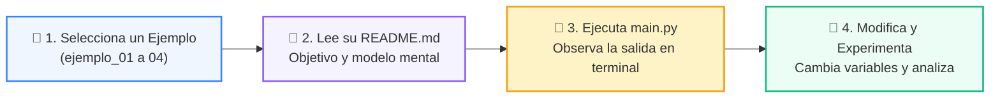

# 💻 Catálogo de Ejemplos Prácticos: Clase 01: Análisis de Complejidad y Notación Big-O

> **Ubicación:** `02-algoritmos-estructuras/clase-01-analisis-complejidad-big-o/ejemplos`  
> **Metodología:** *La Regla de la Bicicleta (Pedaleo en VS Code)*  

Esta carpeta contiene los ejemplos de código interactivos y comentados diseñados para ver la teoría en acción.

---

## 🌀 Flujo de Experimentación y Pedaleo



---

## 📑 Ejemplos Disponibles

| Subcarpeta | Tipo de Demostración | Archivo de Código |
| :--- | :--- | :---: |
| [`ejemplo_01_constante_o1/`](ejemplo_01_constante_o1/) | Demostración paso a paso | [`main.py`](ejemplo_01_constante_o1/main.py) |
| [`ejemplo_02_lineal_on/`](ejemplo_02_lineal_on/) | Demostración paso a paso | [`main.py`](ejemplo_02_lineal_on/main.py) |
| [`ejemplo_03_cuadratico_on2/`](ejemplo_03_cuadratico_on2/) | Demostración paso a paso | [`main.py`](ejemplo_03_cuadratico_on2/main.py) |
| [`ejemplo_04_benchmark_perf_counter/`](ejemplo_04_benchmark_perf_counter/) | Demostración paso a paso | [`main.py`](ejemplo_04_benchmark_perf_counter/main.py) |


---

## 🚀 Cómo Ejecutar los Ejemplos
Desde la terminal en la raíz del repositorio:
```bash
python 02-algoritmos-estructuras/clase-01-analisis-complejidad-big-o/ejemplos/<carpeta_ejemplo>/main.py
```
