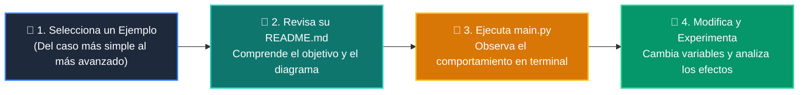

# 💻 Catálogo de Ejemplos Prácticos: Clase 01: Análisis de Complejidad y Notación Big-O

> **Ubicación:** `curso/clase-01-analisis-complejidad-big-o/ejemplos`  
> **Filosofía:** *Aprender programando mediante casos de uso aislados, legibles y comentados.*

---

## 🗺️ Flujo de Estudio Recomendado



---

## 📑 Ejemplos Disponibles en esta Clase

| Directorio | Caso de Uso Demostrado | Script Principal |
| :--- | :--- | :---: |
| [`ejemplo_01_constante_o1/`](ejemplo_01_constante_o1/) | 01 Constante O1 | [`main.py`](ejemplo_01_constante_o1/main.py) |
| [`ejemplo_02_lineal_on/`](ejemplo_02_lineal_on/) | 02 Lineal On | [`main.py`](ejemplo_02_lineal_on/main.py) |
| [`ejemplo_03_cuadratico_on2/`](ejemplo_03_cuadratico_on2/) | 03 Cuadratico On2 | [`main.py`](ejemplo_03_cuadratico_on2/main.py) |
| [`ejemplo_04_benchmark_perf_counter/`](ejemplo_04_benchmark_perf_counter/) | 04 Benchmark Perf Counter | [`main.py`](ejemplo_04_benchmark_perf_counter/main.py) |


---

## 🚀 Cómo Ejecutar Cualquier Ejemplo
Abre tu terminal en la raíz del repositorio y ejecuta:
```bash
python 01-fundamentos-python/clase-01-analisis-complejidad-big-o/ejemplos/<nombre_del_ejemplo>/main.py
```
