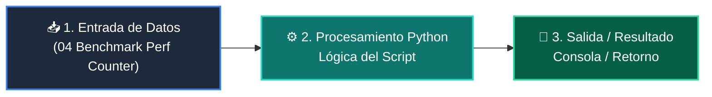

# 📖 04 Benchmark Perf Counter

> **Clase:** Clase 01: Análisis de Complejidad y Notación Big-O  
> **Script:** [`main.py`](main.py)  

Medición de Tiempo con perf_counter.

---

## 🗺️ Flujo de Ejecución del Ejemplo



---

## 💻 Ejecución desde Terminal

```bash
python 02-algoritmos-estructuras/clase-01-analisis-complejidad-big-o/ejemplos/ejemplo_04_benchmark_perf_counter/main.py
```
