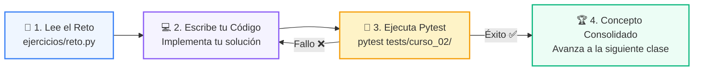

# 🏋️ Reto Práctico: Clase 01: Análisis de Complejidad y Notación Big-O

> **Curso:** 02-algoritmos-estructuras &bull; **Semana:** CLASE 01  
> **Ubicación:** `02-algoritmos-estructuras/clase-01-analisis-complejidad-big-o/ejercicios`  

---

## 🌀 Ciclo de Resolución y Validación



---

## 🎯 Desafío de la Sesión
> **Enunciado:** Escribe un script que compare el tiempo real de buscar un elemento en una lista vs un set de 500.000 elementos.

---

## 🚀 Pasos para Resolverlo
1. Abre el archivo [`reto.py`](reto.py).
2. Escribe tu lógica de solución.
3. Valida tus resultados ejecutando las pruebas unitarias:
   ```bash
   pytest tests/curso_02/
   ```
