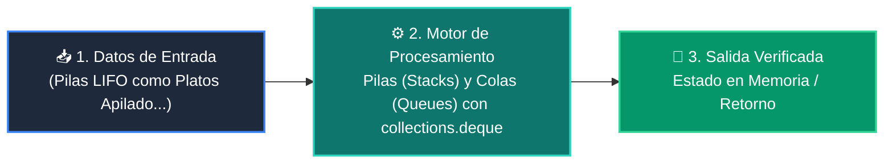

# 📘 Clase 02: Pilas (Stacks) y Colas (Queues) con collections.deque

<div align="center">

**Curso 2: Algoritmos Avanzados y Estructuras de Datos** &bull; **Semana CLASE 02**  
*Nivel:* `Nivel 2 - Intermedio` &bull; *Metáfora Central:* **«Pilas LIFO como Platos Apilados y Colas FIFO como la Fila del Supermercado»**

[](https://colab.research.google.com/github/wisrovi/wisrovi-python/blob/main/02-algoritmos-estructuras/clase-02-pilas-y-colas/notebook/clase-02-pilas-y-colas.ipynb)
[](clase-02-pilas-y-colas.pdf)
[](book.md)

</div>

---

## 🎯 Objetivos de Aprendizaje de la Sesión

*   **Competencia Conceptual:** Comprender el modelo mental de *«Pilas LIFO como Platos Apilados y Colas FIFO como la Fila del Supermercado»* (Una pila es como una torre de platos (el último que pones es el primero que lavas); una cola es la fila del banco (el primero en llegar es el primero en ser atendido).).
*   **Competencia Práctica:** Escribir, ejecutar y depurar scripts en Python aplicando buenas prácticas (PEP 8) y tipado.
*   **Competencia de Ingeniería:** Resolver el reto práctico de la sesión y verificar su correcto funcionamiento con la suite de pruebas automatizadas.

---

## 🗺️ Mapa de Arquitectura y Flujo de Ejecución



---

## 📂 Organización de Materiales en esta Clase

```text
clase-02-pilas-y-colas/
├── 📄 clase-02-pilas-y-colas.pdf       # Manual técnico oficial de estudio (9 páginas)
├── 📖 book.md                     # Libro digital interactivo con diagramas Mermaid
├── 📝 README.md                   # Esta guía general de la clase
├── 📁 notebook/                   # Cuaderno Jupyter interactivo
│   ├── 📓 clase-02-pilas-y-colas.ipynb
│   └── 📝 README.md               # Guía con badge a Google Colab
├── 📁 ejemplos/                   # Carpetas de código estructurado paso a paso
│   └── 📝 README.md               # Catálogo de ejemplos con comandos de ejecución
└── 📁 ejercicios/                 # Reto práctico para el estudiante
    ├── 🐍 reto.py                 # Enunciado y plantilla del ejercicio
    └── 📝 README.md               # Instrucciones de resolución y comandos pytest
```

---

## 🏋️ Desafío Práctico de la Sesión
> **Enunciado:** Implementa un historial de navegación web con funciones ir_a(url), atras() y adelante() usando dos pilas.

Abre el archivo [`ejercicios/reto.py`](ejercicios/reto.py), completa tu implementación y valida tu código ejecutando:
```bash
pytest tests/curso_02/test_clase_02_pilas_y_colas.py
```
