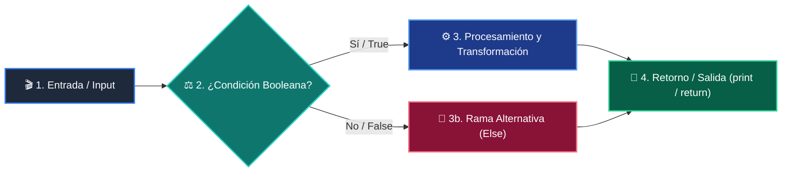

# 📚 Clase 02: Pilas (Stacks) y Colas (Queues) con collections.deque

> **Programa:** Curso 2: Algoritmos Avanzados y Estructuras de Datos  
> **Nivel:** Nivel 2 - Intermedio  
> **Metáfora Central:** *«Pilas LIFO como Platos Apilados y Colas FIFO como la Fila del Supermercado»*  
> **Documento Oficial PDF:** [clase-02-pilas-y-colas.pdf](clase-02-pilas-y-colas.pdf)  
> **Instructor:** **William Rodríguez (Wisrovi)** (AI Solutions Architect & Principal Software Engineer)  

---

## 👤 Perfil del Autor y Mentor

### **William Rodríguez (Wisrovi)**
*AI Solutions Architect & Principal Software Engineer &bull; Badajoz, España*

Ingeniero y arquitecto de software especializado en Inteligencia Artificial Generativa, sistemas multi-agente, Visión por Computador e infraestructuras MLOps de alta disponibilidad. Creador y mantenedor de la suite de software libre wisrovi SUITE en PyPI con más de 26 bibliotecas enfocadas en orquestación de pipelines, caching distribuido y optimización de bases de datos.

*   🐙 **GitHub:** [github.com/wisrovi](https://github.com/wisrovi)
*   💼 **LinkedIn:** [www.linkedin.com/in/wisrovi-rodriguez/](https://www.linkedin.com/in/wisrovi-rodriguez/)
*   🐳 **DockerHub:** [hub.docker.com/u/wisrovi](https://hub.docker.com/u/wisrovi)
*   🌐 **Website:** [wisrovi.dev](https://wisrovi.dev)
*   📦 **PyPI:** [pypi.org/user/wisrovi/](https://pypi.org/user/wisrovi/)

---

### 🚲 La Regla de la Bicicleta

> *"Nadie aprende a montar en bicicleta viendo tutoriales. El verdadero dominio de la programación surge cuando abres tu editor, escribes código con tus propias manos, resuelves errores y construyes proyectos reales."*

---

## 📑 Tabla de Contenidos de la Sesión

1. [💡 Fundamentación Teórica y Modelo Mental](#1--fundamentación-teórica-y-modelo-mental)
2. [🗺️ Arquitectura y Diagrama de Flujo](#2-️-arquitectura-y-diagrama-de-flujo)
3. [💻 Implementación en Python 3.10+](#3--implementación-en-python-310)
4. [🛡️ Buenas Prácticas y Trampas Frecuentes](#4-️-buenas-prácticas-y-trampas-frecuentes)
5. [🏋️ Desafío de Práctica](#5-️-desafío-de-práctica)
6. [📚 Bibliografía y Enlaces Canónicos](#6--bibliografía-y-enlaces-canónicos)

---

## 1. 💡 Fundamentación Teórica y Modelo Mental

Las pilas y colas son estructuras de datos lineales que restringen la inserción y extracción según una disciplina estricta.

> [!NOTE]
> **🌟 Metáfora Didáctica:** Una pila es como una torre de platos (el último que pones es el primero que lavas); una cola es la fila del banco (el primero en llegar es el primero en ser atendido).

### Principios Fundamentales

Una lista de Python como cola es ineficiente: lista.pop(0) es O(n) porque desplaza todos los elementos en memoria.

collections.deque implementa una lista doblemente enlazada con inserción y extracción O(1) en ambos extremos.

> [!IMPORTANT]
> **⚡ Regla de Oro en Python:** Nunca uses lista.pop(0) para colas; usa siempre collections.deque().popleft().

---

## 2. 🗺️ Arquitectura y Diagrama de Flujo

Mecanismo de inserción y extracción LIFO (Stack) vs FIFO (Queue).



### Desglose Paso a Paso del Flujo

| Fase | Acción del Intérprete | Estado en Memoria |
| :--- | :--- | :--- |
| **1. Inicialización** | Inserción de elementos (append / push). | `Elemento en el extremo derecho.` |
| **2. Evaluación** | Operación de consulta del tope (peek). | `Lectura sin extracción.` |
| **3. Transformación** | Extracción LIFO (pop) o FIFO (popleft). | `Puntero de nodo actualizado en O(1).` |
| **4. Retorno / Salida** | Verificación de estructura vacía. | `Longitud 0 confirmada.` |

> [!TIP]
> **🔍 Visualización Mental:** Para deshacer cambios (Ctrl+Z) usa una Pila; para procesar mensajes de cola usa una Cola.

---

## 3. 💻 Implementación en Python 3.10+

```python
# CLASE 02 - Código de Demostración
from collections import deque

# 1. Pila (Stack LIFO)
def balanceado(expr: str) -> bool:
    pila = []
    mapa = {")": "(", "}": "{", "]": "["}
    for char in expr:
        if char in mapa.values(): pila.append(char)
        elif char in mapa:
            if not pila or pila.pop() != mapa[char]: return False
    return len(pila) == 0

# 2. Cola (Queue FIFO)
cola = deque(["Ticket 1", "Ticket 2", "Ticket 3"])
cola.append("Ticket 4")
print("Atendido:", cola.popleft())  # Ticket 1
print("Es valido:", balanceado("{[()]}"))
```

*Uso de lista nativa como Pila LIFO y deque para Colas FIFO con rendimiento O(1).*

---

## 4. 🛡️ Buenas Prácticas y Trampas Frecuentes

> [!WARNING]
> **⚠️ Gotcha Frecuente (Trampa de Principiante):** Usar list.pop(0) en colas con miles de elementos colapsa el rendimiento de la CPU.

*   **❌ Antipatrón:**
    ```python
cola = []
cola.append(x)
primero = cola.pop(0)  # ❌ O(n) movimiento de bloques en memoria
    ```

*   **✅ Patrón Correcto:**
    ```python
from collections import deque
cola = deque()
cola.append(x)
primero = cola.popleft()  # ✅ O(1) instantáneo
    ```

> [!TIP]
> **💡 Consejo Profesional:** deque también permite definir maxlen para crear buffers circulares de tamaño fijo.

---

## 5. 🏋️ Desafío de Práctica

> **Desafío:** Implementa un historial de navegación web con funciones ir_a(url), atras() y adelante() usando dos pilas.

Para ejecutar la verificación automática con pytest:
```bash
pytest ejercicios/
```

---

## 6. 📚 Bibliografía y Enlaces Canónicos

| Fuente / Recurso | Descripción | Enlace |
| :--- | :--- | :--- |
| **Documentación Oficial de Python** | Especificación y biblioteca estándar | [docs.python.org/3/](https://docs.python.org/3/) |
| **PEP 8 — Style Guide for Python** | Estándar oficial de formateo y estilo | [peps.python.org/pep-0008/](https://peps.python.org/pep-0008/) |
| **Real Python Tutorials** | Patrones de ingeniería y desarrollo | [realpython.com](https://realpython.com/) |
| **Suite Open Source wisrovi** | Librerías de alto rendimiento | [github.com/wisrovi](https://github.com/wisrovi) |
