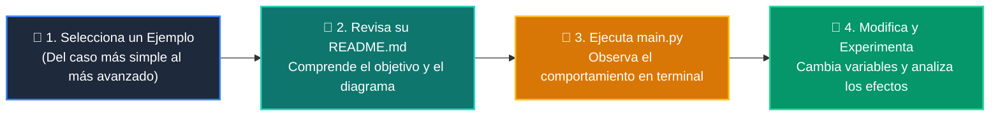

# 💻 Catálogo de Ejemplos Prácticos: Clase 02: Pilas (Stacks) y Colas (Queues) con collections.deque

> **Ubicación:** `curso/clase-02-pilas-y-colas/ejemplos`  
> **Filosofía:** *Aprender programando mediante casos de uso aislados, legibles y comentados.*

---

## 🗺️ Flujo de Estudio Recomendado



---

## 📑 Ejemplos Disponibles en esta Clase

| Directorio | Caso de Uso Demostrado | Script Principal |
| :--- | :--- | :---: |
| [`ejemplo_01_pila_lifo/`](ejemplo_01_pila_lifo/) | 01 Pila Lifo | [`main.py`](ejemplo_01_pila_lifo/main.py) |
| [`ejemplo_02_cola_fifo_deque/`](ejemplo_02_cola_fifo_deque/) | 02 Cola Fifo Deque | [`main.py`](ejemplo_02_cola_fifo_deque/main.py) |
| [`ejemplo_03_validador_parentesis/`](ejemplo_03_validador_parentesis/) | 03 Validador Parentesis | [`main.py`](ejemplo_03_validador_parentesis/main.py) |
| [`ejemplo_04_buffer_circular_maxlen/`](ejemplo_04_buffer_circular_maxlen/) | 04 Buffer Circular Maxlen | [`main.py`](ejemplo_04_buffer_circular_maxlen/main.py) |


---

## 🚀 Cómo Ejecutar Cualquier Ejemplo
Abre tu terminal en la raíz del repositorio y ejecuta:
```bash
python 01-fundamentos-python/clase-02-pilas-y-colas/ejemplos/<nombre_del_ejemplo>/main.py
```
